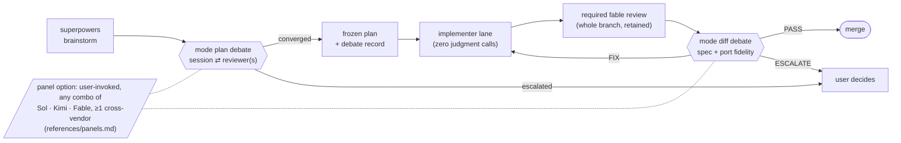
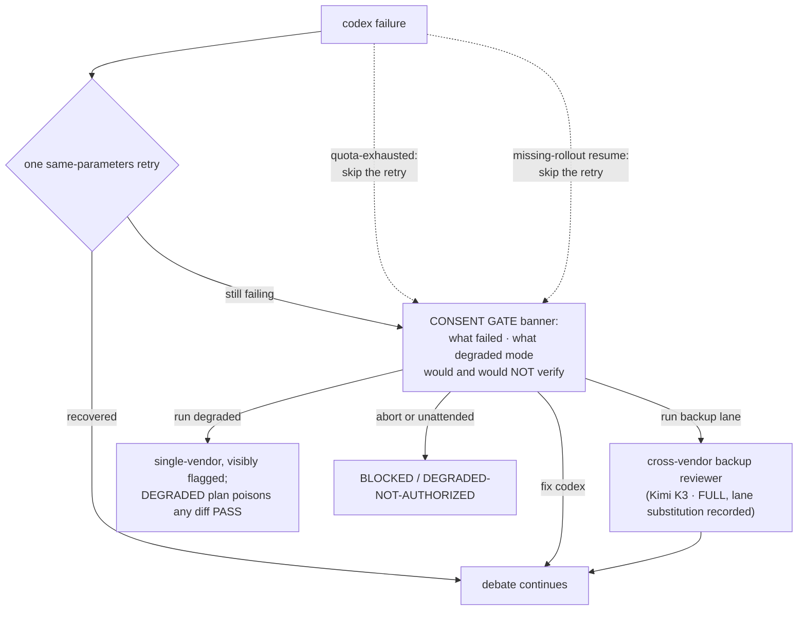

# parallax

**Cross-model verification for Claude Code.** Equal-weight frontier
models — the session driver and at least one cross-vendor reviewer —
verify and refute each other's claims with file:line evidence *before*
a cheaper implementer touches code, and again *before* the result
merges. Neither vendor grades its own homework: when the primary
reviewer transport is down, a consent-gated backup reviewer (Kimi K3
via kimi-cli) substitutes a second cross-vendor seat rather than
degrading to single-vendor review, and the user can convene
multi-reviewer panels for work worth more than one set of eyes.

Companion to [superpowers](https://github.com/obra/superpowers), not a
replacement: it fills the cross-model review gap superpowers rules out of
scope.

## Current lineup

Every seat is a plug (see [Swapping lanes](#swapping-lanes)); this
table is descriptive — the binding declarations live in
`skills/multi-model-verify/references/model-prompting-notes.md` and
the agent files:

| Seat | Model today | Transport |
|---|---|---|
| Session driver — debates, adjudicates, merges | Any Claude model (rules attach to the seat) | Claude Code |
| Cross-vendor reviewer (primary) | GPT-5.6 Sol | OpenAI codex CLI, `exec` read-only |
| Cross-vendor reviewer (backup, consent-gated) | Kimi K3 | kimi-cli, contained agent-file, read-only |
| Panel reviewer (Claude lane, panels only) | Fable | `agents/fable-panel-reviewer.md`, read-only subagent |
| Whole-branch reviewer (required before mode diff) | Fable | `agents/fable-reviewer.md`, read-only subagent |
| Implementer (mechanical) | Gemini 3.6 Flash | Antigravity CLI (`agy`) via haiku wrapper, `agents/flash-implementer.md` |
| Implementer (transcription) | Claude tier | `agents/implementer.md` (frontmatter default `sonnet`; haiku per dispatch) |
| Implementer (escalation, judgment inside an envelope) | Fable | `agents/escalation-implementer.md` |

## How it works



- **Mode `plan`** — after brainstorming, before the implementation plan is
  written. The models debate the approach, port-fidelity claims, and the
  API/behavior risk register until convergence or the round cap, then the
  converged plan is frozen with a full debate record
  (participants, rounds, resolved/struck/escalated points, verification
  status).
- **Mode `diff`** — after implementation, alongside superpowers code review.
  A required whole-branch review from the fable-reviewer seat runs first
  and its retained, range-bound report feeds the debate brief; then a
  PostToolUse hook fingerprints the superpowers code-reviewer dispatch and
  injects the diff-mode reminder with the same base/head SHAs, so both
  reviews always look at the same range. Verdicts are PASS / FIX / ESCALATE
  from *each* side.
- **Panels** — either mode can run as a user-invoked multi-reviewer panel:
  any combination of the Sol, Kimi, and Fable lanes that keeps at least
  one cross-vendor seat. See [Panels](#panels).

The debate rules that keep this honest
(`skills/multi-model-verify/references/debate-protocol.md`):

- **Strike rule** — every externally checkable claim carries a citation the
  other side can read (`References/<addon>/<file>:<line>`, API docs, a dated
  probe). Uncited claims are struck, not debated.
- **Equal weight** — disagreements resolve by evidence, never by which model
  said it. Unresolvable points escalate to the user with both positions.
- **Round cap** — 4 exchanges by default; convergence in one round on a
  sound plan is the system working, and manufactured objections are a
  protocol violation, not diligence.
- **Session continuity** — the reviewer keeps debate state across rounds via
  `codex exec … resume <SESSION_ID>`; the full context is sent once.
- **Final adjudication** — the session always has the last step: it
  verifies the reviewer's final round against the repo and emits the
  terminal verdict itself. A reviewer PASS/FIX is input, never the
  decision; genuine deadlocks escalate to the user. The rule attaches to
  the *role*, not the model — it holds whoever fills the session seat.

## What's in the box

| Piece | What it does |
|---|---|
| `skills/multi-model-verify/` | The debate skill: both modes, debate protocol, frozen-plan format, model prompting notes, fallbacks/consent gate |
| `skills/multi-model-verify/references/backup-lane.md` | The cross-vendor backup reviewer lane — currently Kimi K3 via kimi-cli: consent-gated substitution when codex is down — the gate's "run backup lane" option (backup model id pinned in model-prompting-notes.md) |
| `skills/multi-model-verify/references/panels.md` | Multi-reviewer panels: any lane combination with at least one cross-vendor seat; hub-and-spoke blind relay; subject-revision binding |
| `hooks/` | PostToolUse + PostToolUseFailure hook (matcher `Task\|Agent`): fingerprints the superpowers code-reviewer dispatch, injects the mode-`diff` reminder with matching SHAs; inert everywhere else |
| `agents/implementer.md` | Zero-judgment direct-typing executor for frozen-plan tasks (model pinned in the file's frontmatter) |
| `agents/flash-implementer.md` | Zero-judgment Flash lane: haiku wrapper drives Gemini Flash through the Antigravity CLI headlessly; route + authorship evidence checked every run (model literal pinned in the file) |
| `agents/escalation-implementer.md` | Fable escalation lane: implementation judgment ONLY inside a plan-enumerated decision envelope, every decision logged for the diff debate to adjudicate |
| `agents/fable-reviewer.md` | The required whole-branch review before every mode-diff debate — read-only, raw reply retained as a range-bound artifact |
| `agents/fable-panel-reviewer.md` | The Claude-side panel reviewer lane — read-only, resumable, dispatch-metadata evidence class |
| `commands/drift-triage.md` | `/parallax:drift-triage` — reads the newest drift report, verifies each finding against the live contract surfaces, repairs on a branch |
| `commands/doctor.md` | `/parallax:doctor` — operational health check: checkout-vs-installed version, hook registration, superpowers fingerprint, codex transport round-trip, backup lane, drift task + pending entries. Reports, never fixes |
| `commands/intake.md` | `/parallax:intake` — external-reference intake: clone read-only as untrusted subject data, ground every claimed delta on both sides, probe-gate behavior claims, rank dispositions for the user's scope pick, then hand into the multi-model-verify debate |
| `evals/` | Four gate tiers for the skill itself — see [Verify](#verify) |
| `evals/multi-model-verify/contract_coverage.py` | Contract coverage: every marked document region must sit whole inside some test pin. Closes the pin-integrity class that produced twelve instances across three cycles |
| `tools/check-drift.ps1` | Weekly drift watch over the upstreams the contract depends on — see [Drift protection](#drift-protection) |
| `tools/write-attestation.ps1` · `tools/verify-attestation.ps1` | SHA-bound review attestations — see [Attestation lane](#attestation-lane) |
| `tools/kimi-lane-lock.ps1` | Serializes the backup lane's dispatches: its route evidence comes from one user-global log, so two concurrent debates interleave and neither can be attributed. Advisory, age-bounded, breaks after 45 min |
| `.githooks/pre-push` | Non-blocking attestation check on `main` pushes (`git config core.hooksPath .githooks` to enable) |

## Fails loud, never silent

The governing rule
(`skills/multi-model-verify/references/fallbacks.md`): **no transition that reduces
vendor diversity, evidence quality, or conversation continuity happens
without explicit user consent.**



- One same-parameters retry is the **only** automatic recovery; every other
  transition stops at the consent gate. Unattended runs fail closed.
  (Pre-dispatch failures retry free; a post-dispatch retry is the bounded
  re-spend — never a loop.)
- Session/weekly usage limits get a dedicated `quota-exhausted` class: no
  retry (quota windows don't clear in seconds), and the banner quotes
  codex's reset time verbatim. A resume failing with the missing-rollout
  signature ("no rollout found ... code -32600", probed 2026-07-24) also
  skips the retry — the rollout is gone; straight to the session-loss
  consent gate.
- **Effective-route check (0.6.0; `sandbox:` line added in 0.8.0)**: every
  codex call's startup header
  (`model:` / `provider:` / `reasoning effort:` / `sandbox: read-only`,
  plus the `session id:` on
  resume) is verified against the canonical declarations — a config.toml
  override or profile silently swapping the reviewer is a named
  `route-mismatch` class: no retry, reply discarded, consent gate.
  (Sandbox mode has no continuity across resumes — an omitted flag falls
  back to the config default, probed 2026-07-24.) The
  call itself runs with reroute-capable env vars stripped
  (`CODEX_API_KEY`, `OPENAI_API_KEY`, `OPENAI_BASE_URL`, `CODEX_HOME`) after a
  `codex login status` preflight that requires the first-party ChatGPT
  state, not merely exit 0.
- A lane failing mid-panel gets the same treatment (`panel-lane-loss`):
  the panel stops at the consent gate — continuing with fewer lanes never
  happens automatically, and a remainder without a cross-vendor lane can
  only proceed as DEGRADED.
- A DEGRADED-frozen plan cannot produce an ordinary diff PASS: mode `diff`
  must first retrospectively cross-verify the plan's claims, and if
  cross-vendor is *still* unavailable the only terminal state is
  `ESCALATE — CROSS-VENDOR GATE UNSATISFIED`.
- Missing reference material for a port is a **hard stop** (ask the user),
  never a degraded mode — a debate about remembered code is two models
  fabricating at each other.
- **Reviewer context isolation (0.17.0)**: the gate measures the
  cross-vendor reviewer's PROMPT.
  `tools/codex-context-probe.ps1` renders the model-visible prompt with
  `codex debug prompt-input` (no tokens, no model call), classifies every
  instruction source by where it came from, generates the skill-disable
  override the dispatch then carries, and re-measures. A clean result
  means no skill is advertised, no plugin or apps block is present, and
  nothing inside the reviewed tree is instructing the reviewer. An unmade
  or unreadable measurement is never a clean one. **Two things it does
  not mean.** The user's global `AGENTS.md` survives a clean result and
  is recorded rather than removed — nothing available removes it. And the
  reviewer's TOOL surface (configured MCP servers, the memories feature)
  is not in the prompt and is not measured: observed 2026-07-28, an MCP
  tool ran inside a round that passed every check above. Tracked as
  backlog item 7.

## Panels

For work worth more than one reviewer, the user can convene a panel
(`skills/multi-model-verify/references/panels.md`): any combination of
the Sol, Kimi, and Fable lanes — Sol+Kimi, Sol+Fable, Kimi+Fable, or
all three — with one invariant: **every panel contains at least one
cross-vendor lane**; an all-Claude panel is invalid by contract test.
The driver mediates hub-and-spoke: reviewer lanes never talk to each
other, findings relay anonymously with their evidence (blind
cross-examination — independently convergent findings are the
strongest signal the system produces), every round brief pins the
subject revision, and each lane keeps its own transport, evidence
rules, and round cap unchanged. Panels are user-invoked only — the
default remains the bilateral Sol debate.

## Swapping lanes

Every role is a plug — the contracts attach to roles, not models. Today's
lineup is one configuration:

- **Session driver** — whatever Claude model runs the session (`/model`);
  the debate rules and final adjudication follow the seat automatically,
  and per-model driver notes live in
  `skills/multi-model-verify/references/model-prompting-notes.md` (The
  session driver seat).
- **Implementer, Claude tier** — edit one line: `model:` in
  `agents/implementer.md` frontmatter (any Claude tier is a drop-in). The contract (zero judgment calls, INPUT GAP rule, structured
  report) stays identical whoever fills it.
- **Implementer, cross-vendor** (the fable-advisor v3 Grok pattern) —
  agent frontmatter only accepts Claude tiers, so a vendor swap uses the
  supervisor pattern `agents/flash-implementer.md` implements (documented in `agents/implementer.md`'s Lane note): a cheap Claude
  model supervises, delegates the body of work to the vendor CLI, and
  re-runs verification itself.
- **Implementer, escalation** — `agents/escalation-implementer.md`: the
  judgment-heavy lane; its authority comes from the frozen plan's
  enumerated decision envelope, never from the model filling it.
- **Cross-vendor reviewer** — a ONE-LINE swap: the canonical model id and
  reasoning effort live solely in
  `skills/multi-model-verify/references/model-prompting-notes.md`. The
  behavioral runner and the drift watch parse those declarations at
  runtime (failing loud if they vanish), and every instruction surface
  (SKILL.md transport commands, doctor, drift-triage) reads them from
  there; a consistency test forbids a hardcoded `-m` literal anywhere
  else. The backup reviewer (Kimi K3 via kimi-cli, consent-gated per
  fallbacks.md) swaps the same way — its declarations live in the same
  file (after the primary's, as the parsers require), under the same
  single-source test.
- **Fable review seats** — `agents/fable-reviewer.md` and
  `agents/fable-panel-reviewer.md` pin `model: fable` in frontmatter;
  a tier swap is that one line, with the read-only tool grant and
  evidence class unchanged.

## Requirements

- Claude Code on a current frontier model; superpowers plugin enabled
- OpenAI codex CLI 0.144+ authenticated via ChatGPT sign-in, on a plan with
  access to the canonical reviewer model (id, effort, and tier notes:
  `skills/multi-model-verify/references/model-prompting-notes.md`)
- `pwsh` (PowerShell 7) for the hook; Windows PowerShell 5.1 for the drift
  watch scheduled task; Python 3.10+ for the evals
- Optional — backup reviewer lane: kimi-cli 1.49+ authenticated (Kimi K3;
  backup model id and thinking flag declared in
  `skills/multi-model-verify/references/model-prompting-notes.md`)
- Optional — Flash implementer lane: the Antigravity CLI (`agy`)
  authenticated (Gemini 3.6 Flash; model literal pinned in
  `agents/flash-implementer.md`)
- The Fable seats need no extra transport — they are Claude Code
  subagents

## Install

Stable:

```
claude plugin marketplace add Bmwascher/parallax
claude plugin install parallax@parallax
```

Dev loop — Claude Code copies installs into a **versioned cache**, so
checkout edits are NOT live until re-synced:

```
claude plugin marketplace add <path-to-this-checkout>
claude plugin install parallax@parallax
# after edits: bump .claude-plugin/plugin.json version, then
claude plugin update parallax@parallax   # qualified name required
# restart the Claude Code session to re-register hooks/skills
```

Forgetting a step here is the failure mode that looks like a plugin bug: a
stale cache runs yesterday's skill, a missed restart leaves the hook
unregistered. `/parallax:doctor` reports both, plus the fingerprint, the
codex transport, quota headroom (best-effort, experimental), the backup
lane, and any unresolved drift — in one table.

## Verify

| Tier | Gate | Command | Runs |
|---|---|---|---|
| 1 — structure | Spec lint + security scan | `python evals/tools/skill_lint.py skills/multi-model-verify --strict` · `python evals/tools/skill_scanner.py skills` | CI + local |
| 2 — routing | Trigger/routing evals | `python evals/tools/run_trigger_evals.py` | CI + local |
| 2.5 — contract | Structural pytest suite (hook e2e under pwsh, pinned superpowers template fixture, transport/fallback/status-field/seat pins) | `python -m pytest evals -q` | CI + local |
| 3 — behavior | Real headless `claude -p` executor runs each case in a throwaway workspace (synthetic `References/DemoWidget` fixture; codex stripped from PATH for degraded cases), graded expectation-by-expectation by the cross-vendor reviewer — the executor's vendor never grades itself | `python evals/tools/run_behavioral_evals.py` | local only |

Tier 3 tests the **installed** plugin, not the checkout — run the dev-loop
re-sync first. Lint/scan/trigger/pytest run in CI on every push.

Both modes are executed, not just described: the diff-mode case builds a real
two-commit git history in the workspace (frozen plan → implementation with a
planted throttle deviation from the reference) and hands the run the actual
base/head SHAs, so a pass means the debate found the drift in a real diff.

The drift script has its own offline state machine —
`evals/tools/drift_statemachine_tests.ps1` drives the **real**
`tools/check-drift.ps1` through its scenarios against stub CLIs and a
throwaway clone: probe-failure carry-forward, the verdict trust matrix,
both halves of the toast matrix, the pytest gate, commit failure,
off-grammar cross-review, an effective-route mismatch, a failed auth
preflight, kimi flag/vocabulary/version drift, pending lifecycle, and
the hung-agent kill. Slow and opt-in — run it whenever
`check-drift.ps1` changes:

```powershell
.\evals\tools\drift_statemachine_tests.ps1
# or through pytest:
$env:PARALLAX_STATEMACHINE = "1"; python -m pytest evals -q
```

## Drift protection

parallax's contract points at moving targets it does not control.
`tools/check-drift.ps1` watches them; a clean run raises no toast
(the report is still archived under `tools/drift-reports/` — gitignored,
machine-local).

| Upstream | Risk | Check |
|---|---|---|
| superpowers | Template rewrite rots the hook fingerprint (`Senior Code Reviewer` / `Git Range to Review`) or the `Base:`/`Head:` extraction | Every run: hash the installed template against the pinned fixture; CRITICAL if the fingerprints are gone |
| Claude Code | Surface changes — the Task→Agent tool rename (v2.1.63) silently killed the hook matcher once already | On version change: fetch the changelog slice between versions and grep for hook/plugin/matcher/skill/tool-rename keywords |
| codex CLI | `exec` transport flags the skill's commands depend on | Every run: probe `--sandbox`, `--output-last-message`, model/config flags, and the `exec resume` subcommand |
| kimi-cli | Backup-lane flags (`--agent-file`, `-m`, `--thinking`, `-w`, `-r`) and the kimi_cli tool-module vocabulary the containment allowlist names | Every run when kimi is present: token-boundary flag probe + python import probe; version carry-forward when absent |

```
powershell tools/check-drift.ps1            # one-shot
powershell tools/check-drift.ps1 -Register  # weekly scheduled task (Tue 13:17)
powershell tools/check-drift.ps1 -TestNotify  # toast wiring check
```

An unfetchable or not-yet-published changelog never advances the version
snapshot — the watch retries next run rather than skipping past a version it
could not inspect.

Findings don't wait for a human: on a findings-week the script feeds the
report and the triage guide into a **headless Claude Code run**. Because
the report embeds raw upstream text (changelog lines), that agent is
treated as untrusted: it works in a **disposable git worktree** the script
creates, and its isolation is two-layer — `--tools` makes shell, network,
and subagent tools **unavailable** (so ambient settings can't resurrect
them; even `python -c` would be arbitrary execution), while `--allowedTools`
scopes write **approvals** to the worktree — and it is killed after 30
minutes. The script then inspects the diff itself, re-runs the pytest
gate, and only commits (on a `drift/<runid>` branch, never merged) when
the gate is green and the commit verifiably landed. The toast reflects the verified outcome,
so the only interruptions are actionable ones:

A `FIXES-APPLIED` diff also gets a **script-side cross-vendor review**
(read-only, bounded) before the toast — preceded by the auth preflight,
run with the env denylist, and accepted only when the codex header echoes
the canonical route and the strict `REVIEW:` line closes the reply; the
reviewer stays in the loop even unattended, and a failed review reads
"cross-review UNAVAILABLE", never implied-reviewed. The final reviewer is the session, deferred to pickup:
the merge happens in a session that adjudicates the cross-review verdict
and the diff first (debate-protocol.md, Final adjudication), with the
user's approval — nothing merges on the external reviewer's word alone.

| Outcome | Toast |
|---|---|
| `FIXES-APPLIED` + non-empty diff + gates green | "fix ready on `drift/<runid>` (gates green; cross-review: …) — review and merge" |
| `NO-ACTION`, WARN-only noise, no diff | none (verdict archived in the report) |
| `NO-ACTION` but a CRITICAL finding | "verify dismissal by hand" — a CRITICAL is never silently dismissed |
| Gate failed, verdict/diff mismatch, timeout, `BLOCKED` | falls back to the manual toast: run `/parallax:drift-triage` yourself |

`-NoAutoTriage` disables the headless run (detection + manual toast only).
`/parallax:drift-triage` remains available interactively — same guide the
headless run follows.

Unresolved weeks can't fall out of the lifecycle: any run that ends in the
manual toast or an open fix branch writes `tools/drift-pending.json`, and
every later run re-toasts it until the branch is merged/discarded
(auto-clears) or `/parallax:drift-triage` records a disposition —
findings never depend on one noticed toast.

## Attestation lane

A mode-`diff` terminal verdict is also recorded mechanically (0.6.0):
after the session's final adjudication — never from the reviewer's reply
alone — `tools/write-attestation.ps1` writes a SHA-bound JSON record
(repo, base/head SHAs, verdict, rounds, participants, route note) under
the reviewed repo's `.git/parallax/attestations/`. The git dir, not the
working tree: recording the verdict cannot move HEAD out from under its
own SHA, and the record never ships in a commit.

For a panel-reviewed diff the same schema holds under the
strictest-lane rule: `Rounds` records the maximum lane round count,
`Participants` names the driver and every lane, and the route note
reads `effective route confirmed` only when EVERY lane's per-round
evidence matched its own canonical declarations — per-lane detail
lives in the debate record, not the JSON.

`tools/verify-attestation.ps1` is the consumer: a `main` push is attested
when the pushed sha carries a gate-satisfying record (fast-forward), or
when a merge commit's parent2 carries one **against parent1 as its base**
— extra commits, a rebase, or a squash after the review all break the
match and correctly force re-review. Gate-satisfying means verdict PASS
**and** `verification_status: FULL` **and** the confirmed route note — a
DEGRADED or unconfirmed-route PASS is rejected mechanically, not just in
skill prose. The pre-push hooks (this repo's `.githooks/pre-push`;
adapters in consuming repos) call it and **warn, never block** in v1 —
the warning stream is how the lane earns a blocking future.

Enforcement is deliberately **local pre-push lanes only** (re-adjudicated
2026-07-19 after the reviewer flagged the gap): the records live under
`.git` and never ship, so a GitHub-CI check would need an attestation
carrier (git note, PR metadata, or an uploaded artifact) — deferred until
a PR-based merge flow exists; today merges happen locally, so pre-push
IS the integration boundary.

## Application checkpoint

The debate has a hard contract; without one, the **application phase**
reverts to act-immediately bias — a verdict lands and the session starts
editing with no record between "review concluded" and "diffs happening"
(0.7.0, from a live failure observed in a distilled-skill setting). The
checkpoint (`skills/multi-model-verify/references/application-checkpoint.md`)
makes the missing transitions explicit —
`reviewed → dispositioned → authorized → applied → reverified` — and is
what authorizes touching files, not the verdict.

Before the first fix edit the session writes a checkpoint artifact under
the reviewed repo's `.git/parallax/application-checkpoints/`: the reviewed
range and outcome, a disposition per finding, one row per exact file with
its intended **postcondition** (outcomes, never pseudocode), the
verification plan, and an authorization line that either stops for the
user or **quotes the pre-authorizing instruction verbatim**. Scope growth
invalidates the authorization until the checkpoint is amended. At
attestation time `-CheckpointFile` binds the artifact's hash plus the
emitter-computed changed-path set into the record, and the verifier
rejects a record whose path set no longer matches its range. The
behavioral suite grades the contract end-to-end: a mutation-enabled eval
lane (Edit/Write, deliberately no shell) checks the checkpoint precedes
the first edit, refuted findings get no file plan, and the applied edits
match the stated postconditions.

## Pattern lineage

Advisor/evals ideas from
[awesome-llm-apps agent_skills](https://github.com/Shubhamsaboo/awesome-llm-apps);
plugin + self-marketplace shape from
[fable-advisor](https://github.com/DannyMac180/fable-advisor) (whose
v4.0.0 architect-move and mandatory end-review informed the 0.14.0
seat reshuffle — adopted while keeping the reviewer cross-vendor);
vendored eval tooling attribution in `evals/tools/LICENSE-THIRD-PARTY.md`.
MIT licensed.
