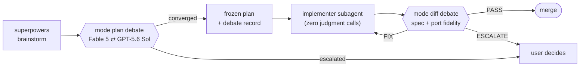
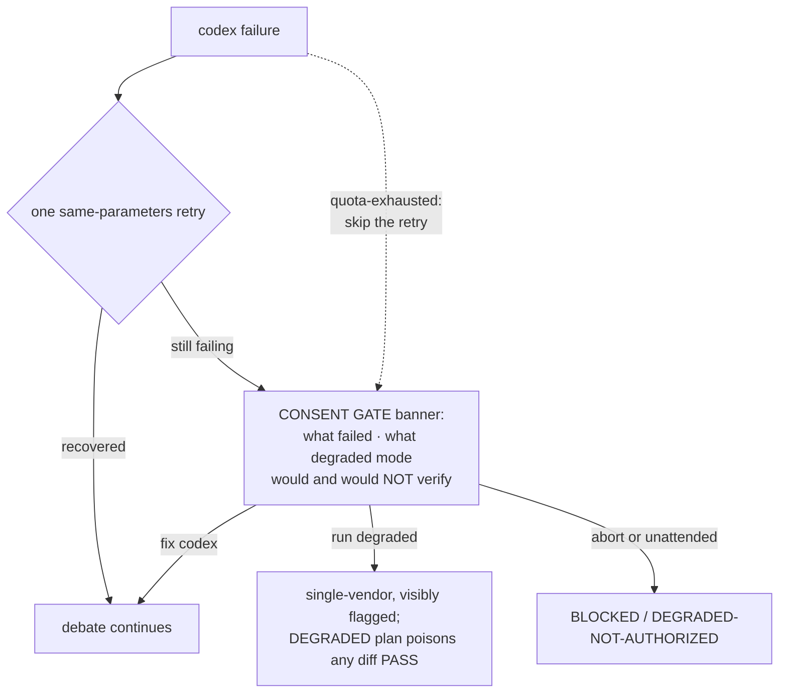

# crosscheck

**Cross-model verification for Claude Code.** Two equal-weight frontier
models — Fable 5 (the session) and GPT-5.6 Sol (via the OpenAI codex CLI) —
verify and refute each other's claims with file:line evidence *before* a
cheaper implementer touches code, and again *before* the result merges.
Neither vendor grades its own homework.

Companion to [superpowers](https://github.com/obra/superpowers), not a
replacement: it fills the cross-model review gap superpowers rules out of
scope.

## How it works



- **Mode `plan`** — after brainstorming, before the implementation plan is
  written. The two models debate the approach, port-fidelity claims, and the
  API/behavior risk register until convergence or the round cap, then the
  converged plan is frozen with a full debate record
  (participants, rounds, resolved/struck/escalated points, verification
  status).
- **Mode `diff`** — after implementation, alongside superpowers code review.
  A PostToolUse hook fingerprints the superpowers code-reviewer dispatch and
  injects the diff-mode reminder with the same base/head SHAs, so both
  reviews always look at the same range. Verdicts are PASS / FIX / ESCALATE
  from *each* side.

The debate rules that keep this honest
(`skills/multi-model-verify/references/debate-protocol.md`):

- **Strike rule** — every externally checkable claim carries a citation the
  other side can read (`References/<addon>/<file>:<line>`, API docs, a dated
  probe). Uncited claims are struck, not debated.
- **Equal weight** — disagreements resolve by evidence, never by which model
  said it. Unresolvable points escalate to the user with both positions.
- **Round cap** — 4 exchanges by default; convergence in one round on a
  sound plan is the system working, and manufactured objections are a
  protocol violation, not diligence.
- **Session continuity** — Sol keeps debate state across rounds via
  `codex exec … resume <SESSION_ID>`; the full context is sent once.
- **Final adjudication** — the session (Fable) always has the last step:
  it verifies the reviewer's final round against the repo and emits the
  terminal verdict itself. A reviewer PASS/FIX is input, never the
  decision; genuine deadlocks escalate to the user.

## What's in the box

| Piece | What it does |
|---|---|
| `skills/multi-model-verify/` | The debate skill: both modes, debate protocol, frozen-plan format, model prompting notes, fallbacks/consent gate |
| `hooks/` | PostToolUse + PostToolUseFailure hook (matcher `Task\|Agent`): fingerprints the superpowers code-reviewer dispatch, injects the mode-`diff` reminder with matching SHAs; inert everywhere else |
| `agents/implementer.md` | Zero-judgment executor for frozen-plan tasks, pinned to the cheap lane (currently `model: sonnet`) |
| `commands/drift-triage.md` | `/crosscheck:drift-triage` — reads the newest drift report, verifies each finding against the live contract surfaces, repairs on a branch |
| `evals/` | Four gate tiers for the skill itself — see [Verify](#verify) |
| `tools/check-drift.ps1` | Weekly drift watch over the three upstreams the contract depends on — see [Drift protection](#drift-protection) |

## Fails loud, never silent

The governing rule
(`skills/multi-model-verify/references/fallbacks.md`): **no transition that reduces
vendor diversity, evidence quality, or conversation continuity happens
without explicit user consent.**



- One same-parameters retry is the **only** automatic recovery; every other
  transition stops at the consent gate. Unattended runs fail closed.
- Session/weekly usage limits get a dedicated `quota-exhausted` class: no
  retry (quota windows don't clear in seconds), and the banner quotes
  codex's reset time verbatim.
- A DEGRADED-frozen plan cannot produce an ordinary diff PASS: mode `diff`
  must first retrospectively cross-verify the plan's claims, and if
  cross-vendor is *still* unavailable the only terminal state is
  `ESCALATE — CROSS-VENDOR GATE UNSATISFIED`.
- Missing reference material for a port is a **hard stop** (ask the user),
  never a degraded mode — a debate about remembered code is two models
  fabricating at each other.

## Swapping the implementer lane

The implementer role is deliberately a plug: the contract (zero judgment
calls, INPUT GAP rule, structured report) stays identical whoever fills it.

- **Claude tier** — edit one line: `model:` in `agents/implementer.md`
  frontmatter (`sonnet` today; `haiku`/`opus` are drop-ins).
- **Cross-vendor** (the fable-advisor v3 Grok pattern) — agent frontmatter
  only accepts Claude tiers, so a vendor swap uses the supervisor pattern
  documented in `agents/implementer.md`: a cheap Claude model supervises,
  delegates the body of work to the vendor CLI, and re-runs verification
  itself.

## Requirements

- Claude Code with Fable 5 access; superpowers plugin enabled
- OpenAI codex CLI 0.144+ authenticated via ChatGPT sign-in, on a plan with
  GPT-5.6 Sol access (Plus or higher — free tier is Terra-only)
- `pwsh` (PowerShell 7) for the hook; Windows PowerShell 5.1 for the drift
  watch scheduled task; Python 3.10+ for the evals

## Install

Stable (any machine with git auth for this private repo):

```
claude plugin marketplace add Bmwascher/crosscheck
claude plugin install crosscheck@crosscheck
```

Dev loop — Claude Code copies installs into a **versioned cache**, so
checkout edits are NOT live until re-synced:

```
claude plugin marketplace add <path-to-this-checkout>
claude plugin install crosscheck@crosscheck
# after edits: bump .claude-plugin/plugin.json version, then
claude plugin update crosscheck@crosscheck   # qualified name required
# restart the Claude Code session to re-register hooks/skills
```

## Verify

| Tier | Gate | Command | Runs |
|---|---|---|---|
| 1 — structure | Spec lint + security scan | `python evals/tools/skill_lint.py skills/multi-model-verify --strict` · `python evals/tools/skill_scanner.py skills` | CI + local |
| 2 — routing | Trigger/routing evals | `python evals/tools/run_trigger_evals.py` | CI + local |
| 2.5 — contract | Structural pytest suite (hook e2e under pwsh, pinned superpowers template fixture, transport/fallback/status-field pins) | `python -m pytest evals -q` | CI + local |
| 3 — behavior | Real headless `claude -p` executor runs each case in a throwaway workspace (synthetic `References/DemoWidget` fixture; codex stripped from PATH for degraded cases), graded expectation-by-expectation by Sol — the executor's vendor never grades itself | `python evals/tools/run_behavioral_evals.py` | local only |

Tier 3 tests the **installed** plugin, not the checkout — run the dev-loop
re-sync first. Lint/scan/trigger/pytest run in CI on every push.

## Drift protection

crosscheck's contract points at three moving targets it does not control.
`tools/check-drift.ps1` watches all three; a clean run raises no toast
(the report is still archived under `tools/drift-reports/` — gitignored,
machine-local).

| Upstream | Risk | Check |
|---|---|---|
| superpowers | Template rewrite rots the hook fingerprint (`Senior Code Reviewer` / `Git Range to Review`) or the `Base:`/`Head:` extraction | Every run: hash the installed template against the pinned fixture; CRITICAL if the fingerprints are gone |
| Claude Code | Surface changes — the Task→Agent tool rename (v2.1.63) silently killed the hook matcher once already | On version change: fetch the changelog slice between versions and grep for hook/plugin/matcher/skill/tool-rename keywords |
| codex CLI | `exec` transport flags the skill's commands depend on | Every run: probe `--sandbox`, `--output-last-message`, model/config flags, and the `exec resume` subcommand |

```
powershell tools/check-drift.ps1            # one-shot
powershell tools/check-drift.ps1 -Register  # weekly scheduled task (Tue 13:17)
powershell tools/check-drift.ps1 -TestNotify  # toast wiring check
```

An unfetchable or not-yet-published changelog never advances the version
snapshot — the watch retries next run rather than skipping past a version it
could not inspect.

Findings don't wait for a human: on a findings-week the script feeds the
report and the triage guide into a **headless Claude Code run**. Because
the report embeds raw upstream text (changelog lines), that agent is
treated as untrusted: it works in a **disposable git worktree** the script
creates, holds **no shell at all** (read/edit tools only — even
`python -c` would be arbitrary execution), and is killed after 30 minutes.
The script then inspects the diff itself, re-runs the pytest gate, and
only commits (on a `drift/<runid>` branch, never merged) when the gate is
green and the commit verifiably landed. The toast reflects the verified outcome,
so the only interruptions are actionable ones:

| Outcome | Toast |
|---|---|
| `FIXES-APPLIED` + non-empty diff + gates green | "fix ready on `drift/<runid>` (gates green) — review and merge" |
| `NO-ACTION`, WARN-only noise, no diff | none (verdict archived in the report) |
| `NO-ACTION` but a CRITICAL finding | "verify dismissal by hand" — a CRITICAL is never silently dismissed |
| Gate failed, verdict/diff mismatch, timeout, `BLOCKED` | falls back to the manual toast: run `/crosscheck:drift-triage` yourself |

`-NoAutoTriage` disables the headless run (detection + manual toast only).
`/crosscheck:drift-triage` remains available interactively — same guide the
headless run follows.

## Pattern lineage

Advisor/evals ideas from
[awesome-llm-apps agent_skills](https://github.com/Shubhamsaboo/awesome-llm-apps);
plugin + self-marketplace shape from
[fable-advisor](https://github.com/DannyMac180/fable-advisor); vendored eval
tooling attribution in `evals/tools/LICENSE-THIRD-PARTY.md`. MIT licensed.
