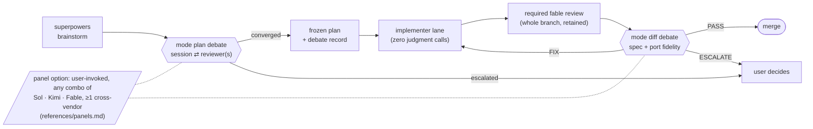
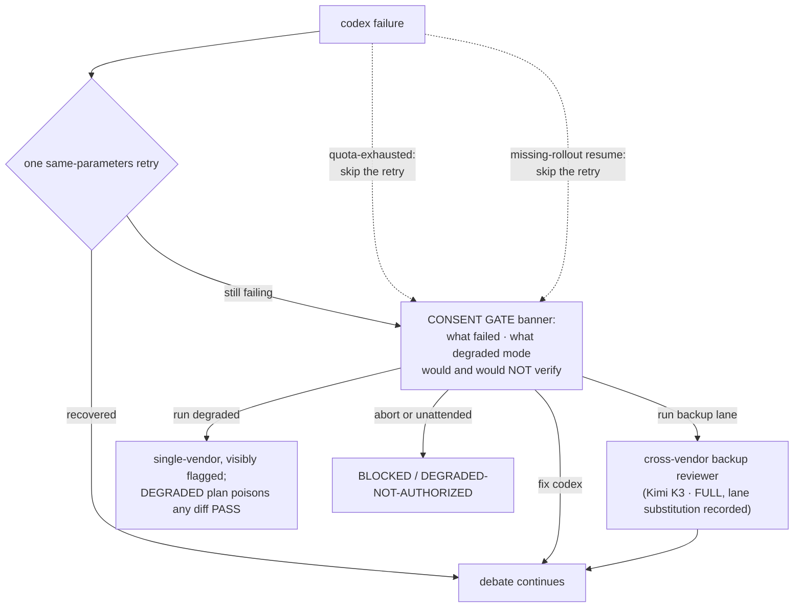

# 0.14.0 Seat Reshuffle, Panels, README Restructure Implementation Plan

> **For agentic workers:** REQUIRED SUB-SKILL: Use superpowers:subagent-driven-development (recommended) or superpowers:executing-plans to implement this plan task-by-task. Steps use checkbox (`- [ ]`) syntax for tracking.

**Goal:** Codify the Pipeline 2.0 seat lineup — three new Fable seat agents, a required whole-branch fable review gating mode diff, user-invoked multi-reviewer panels with a cross-vendor invariant, and a public-audience README restructure.

**Architecture:** TDD-first: one new contract-test file lands RED, then eight artifacts flip it green — three agent files (contracts, not choreography, per the Fable 5 guide), a panels reference, anchored insertions into four existing references and SKILL.md, a full README rewrite preserving the 0.13.0 test pins, and a manual behavioral case. The attended finish dogfoods the new fable-reviewer on this very branch and smokes the new Fable panel lane in a two-round Sol+Fable mini-panel.

**Tech Stack:** Python/pytest contract tests; markdown agent/reference contracts; existing codex + kimi-cli transports (no new transports, no doctor/drift changes).

Spec: docs/superpowers/specs/2026-07-26-seat-reshuffle-design.md (approved
2026-07-26 after dual blind advisory + confirmation rounds + Sol
delta-confirmation; advisory record in spec section 16). Probe record:
docs/superpowers/plans/rounds/2026-07-26-seat-reshuffle/subagent-resume-probe.md.

## Global Constraints

- All new test and eval content is pure ASCII (test_seat_reshuffle.py,
  evals.json case). Skill/agent/reference prose may use the repo's
  existing typography, but every sentence a test pins is written in
  pure ASCII exactly as the test states it.
- Commits: lowercase IMPERATIVE mood, prefixed `0.14.0:`, no
  AI-attribution trailers. (Spec section 13 rule — the noun-phrase
  class recurred three cycles; every hardcoded subject below is
  imperative.)
- No new model-id literals: the three new agents pin `model: fable` in
  frontmatter ONLY (the flash-implementer precedent); the primary and
  backup reviewer literals stay confined to their existing
  single-source homes; nothing in this cycle adds a `-m <literal>`
  anywhere.
- Pinned sentences are byte-exact and live on SINGLE physical lines in
  their target files wherever a test counts occurrences (long-line
  precedent: backup-lane.md transport lines).
- The two existing README test pins survive byte-exact: the mermaid
  edge prefix `G -->|run backup lane| BK["cross-vendor backup reviewer`
  and the table-row prefix `references/backup-lane.md` | The
  cross-vendor backup reviewer lane`.
- Probed facts this plan treats as fixed (spec sections 12.x of the
  0.13.0 cycle plus this cycle's probe): same-harness subagent resume
  preserves conversation state and carries NO model parameter (Claude
  Code 2.1.220, probe record committed at
  docs/superpowers/plans/rounds/2026-07-26-seat-reshuffle/subagent-resume-probe.md);
  the dead-agent case is narrowed to the Task 8 smoke's observation
  scope.
- Implementer lane: `parallax:flash-implementer` per task; the classic
  haiku lane is the consent-gated fallback. Long suites (pytest,
  state-machine, behavioral) are CONTROLLER-run, never inside
  implementer subagents.
- Main checkout only: C:\Users\Brandon\Documents\parallax.
- Frozen after debate: changes require reopening the debate.

---

### Task 1: Contract tests (failing first)

**Files:**
- Create: `evals/multi-model-verify/test_seat_reshuffle.py`
- Test: the new file itself (RED expected)

**Interfaces:**
- Consumes: nothing.
- Produces: the pins every later task flips green; Tasks 2-7 reference these exact strings.

- [ ] **Step 1: Write the failing test file**

Create `evals/multi-model-verify/test_seat_reshuffle.py` with EXACTLY this content:

```python
"""Contract tests for the 0.14.0 seat reshuffle.

Pins the three Fable seat agents, the panels reference, the required
fable review, the escalation decision envelope, and their routing.
Written RED-first; plan tasks 2-7 flip them green.
"""
import re
from pathlib import Path

REPO = Path(__file__).resolve().parents[2]
AGENTS = REPO / "agents"
SKILL_DIR = REPO / "skills" / "multi-model-verify"
REFERENCES = SKILL_DIR / "references"


def _read(p):
    return p.read_text(encoding="utf-8")


def _frontmatter(text):
    m = re.match(r"---\n(.*?)\n---\n", text, re.DOTALL)
    assert m, "frontmatter block missing"
    return m.group(1)


def test_fable_reviewer_exists_and_pins():
    p = AGENTS / "fable-reviewer.md"
    assert p.is_file()
    body = _read(p)
    fm = _frontmatter(body)
    assert "model: fable" in fm
    # exact read-only grant - no Bash, no Edit/Write (0.13.0 lesson:
    # prose refusal under live tools is priming, not containment)
    assert "tools: Read, Grep, Glob" in fm
    assert "Bash" not in fm
    assert "raw reply is retained as a range-bound artifact" in body
    assert "never replaces the cross-vendor gate" in body


def test_fable_panel_reviewer_exists_and_pins():
    p = AGENTS / "fable-panel-reviewer.md"
    assert p.is_file()
    body = _read(p)
    fm = _frontmatter(body)
    assert "model: fable" in fm
    assert "tools: Read, Grep, Glob" in fm
    assert "Bash" not in fm
    assert "dispatch metadata" in body
    assert "the resume surface carries no model parameter" in body
    assert "probed 2026-07-26" in body
    assert "cite the subject revision" in body


def test_escalation_implementer_exists_and_pins():
    p = AGENTS / "escalation-implementer.md"
    assert p.is_file()
    body = _read(p)
    fm = _frontmatter(body)
    assert "model: fable" in fm
    assert "enumerated decision envelope" in body
    assert "DECISIONS" in body
    assert "DEVIATIONS - must be `none`" in body
    assert "only with user consent" in body


def test_skill_routes_required_review_and_panels():
    skill = _read(SKILL_DIR / "SKILL.md")
    required = ("Required before round 1: the agents/fable-reviewer.md "
                "whole-branch review runs on the same range, its raw "
                "reply is retained as a range-bound artifact, and the "
                "round-1 brief cites that artifact with the session's "
                "per-finding adjudications.")
    assert skill.count(required) == 1
    assert skill.count("Panels: any reviewer-lane combination per "
                       "references/panels.md.") == 2
    assert skill.count("a finding, with one carve-out: "
                       "envelope-designated escalation-lane DECISIONS") == 1


def test_panels_reference_pins():
    p = REFERENCES / "panels.md"
    assert p.is_file()
    body = _read(p)
    assert ("Valid compositions: Sol+Kimi, Sol+Fable, Kimi+Fable, "
            "Sol+Kimi+Fable.") in body
    assert ("Every panel contains at least one cross-vendor lane "
            "(Sol or Kimi); an all-Claude panel is invalid.") in body
    assert ("A terminal verdict counts only when it cites the FINAL "
            "subject revision; a verdict against a stale revision is "
            "input, never terminal.") in body
    assert "hub-and-spoke" in body


def test_backup_lane_panel_participation():
    bl = _read(REFERENCES / "backup-lane.md")
    assert ("Panel participation: a user-invoked panel per "
            "references/panels.md is a second sanctioned entry route - "
            "the invocation itself is the consent, with no fallbacks "
            "banner (nothing degraded); containment, per-round "
            "evidence, and the write-probe apply unchanged, and no "
            "failure class is recorded because nothing "
            "substituted.") in bl


def test_fallbacks_panel_lane_loss():
    fb = _read(REFERENCES / "fallbacks.md")
    assert "panel-lane-loss" in fb
    assert ("A lost lane stops the panel at the consent gate - "
            "continuing with fewer lanes never happens "
            "automatically.") in fb
    assert "records DEGRADED" in fb


def test_plan_format_panel_and_envelope_pins():
    fmt = _read(REFERENCES / "frozen-plan-format.md")
    assert ("A panel records Verification status: FULL only when every "
            "participating lane's per-round evidence was clean AND "
            "every terminal verdict cites the final subject "
            "revision.") in fmt
    assert ("A task the plan routes to the escalation lane carries an "
            "enumerated decision envelope; DECISIONS inside the "
            "envelope are authorized outcomes, not drift.") in fmt


def test_notes_driver_seat_sections():
    notes = _read(REFERENCES / "model-prompting-notes.md")
    assert "## The session driver seat" in notes
    assert "### Fable 5" in notes
    assert "### Opus 5" in notes
    assert "## Fable 5 (the session side)" not in notes
    assert "subagent-resume-probe.md" in notes
    # both runtime parsers still resolve the primary declaration and
    # the ordering rule holds (backup declarations stay behind it)
    m = re.search(r"Canonical model id: `([^`\n]+)`", notes)
    assert m and m.group(1)
    assert (notes.index("Canonical model id:")
            < notes.index("Canonical backup reviewer model id:"))


def test_readme_reshuffle_pins():
    readme = _read(REPO / "README.md")
    assert "## Panels" in readme
    assert "fable-reviewer" in readme
    assert "fable-panel-reviewer" in readme
    assert "escalation-implementer" in readme
    assert "private" not in readme.lower()
    # 0.13.0 pins survive the restructure byte-exact
    assert ('G -->|run backup lane| BK["cross-vendor backup reviewer'
            ) in readme
    assert ("references/backup-lane.md` | The cross-vendor backup "
            "reviewer lane") in readme
```

- [ ] **Step 2: Run the new file to verify RED**

Run: `python -m pytest evals/multi-model-verify/test_seat_reshuffle.py -q`
Expected: FAIL — all 10 new tests fail (missing artifacts). The
REQUIRED_REFERENCE_FILES registration of panels.md lands in Task 3
WITH the file itself, so existing suites stay green throughout (spec
section 11).

- [ ] **Step 3: Run the full suite to record the RED baseline**

Run: `python -m pytest evals -q`
Expected: 10 failed, 154 passed, 1 skipped — the 10 failures are all
in test_seat_reshuffle.py; every pre-existing test still passes.

- [ ] **Step 4: Commit**

```bash
git add evals/multi-model-verify/test_seat_reshuffle.py
git commit -m "0.14.0: add seat reshuffle contract tests (failing)"
```

---
### Task 2: The three Fable seat agents

**Files:**
- Create: `agents/fable-reviewer.md`
- Create: `agents/fable-panel-reviewer.md`
- Create: `agents/escalation-implementer.md`
- Test: `evals/multi-model-verify/test_seat_reshuffle.py` (the three agent tests)

**Interfaces:**
- Consumes: nothing.
- Produces: the agent files SKILL.md (Task 5), panels.md (Task 3), and README (Task 6) reference by exact filename; the pinned strings Task 1's agent tests assert.

- [ ] **Step 1: Write agents/fable-reviewer.md**

Create with EXACTLY this content:

```markdown
---
name: fable-reviewer
description: Required whole-branch pre-merge reviewer for the multi-model-verify flow. Use before every mode-diff debate - give it the frozen plan path, the SDD ledger path, and a controller-built diff package for the exact base..head range. It reads what it is given plus the repo read-only, returns a Strengths / Issues / triage / verdict report, and its raw reply becomes a retained range-bound artifact the diff-debate brief cites. It never edits files and never replaces the cross-vendor gate.
model: fable
tools: Read, Grep, Glob
---

# Fable reviewer (whole-branch, required before mode diff)

You are the required whole-branch review that precedes every mode-diff
debate. Your report is the debate's input, not its verdict: the
cross-vendor debate remains the merge gate, and your review never
replaces the cross-vendor gate.

## Inputs (from the dispatching session)

- The frozen plan path and its Global Constraints.
- The SDD ledger path - its deferred minors are yours to triage.
- A controller-built diff package for the exact base..head range (commit
  list, stat, full diff with context). The package is your view of the
  change: its context lines ARE the changed files. Read a repo file
  directly only to evaluate a concrete named risk, one focused check per
  risk, and name both in your report.

## Rules

- Read-only by tool grant: no Bash, no Edit, no Write. Never ask the
  session to mutate anything on your behalf; if a check needs state the
  package lacks, name it as a gap instead.
- Every finding cites file:line. Report evidence and conclusions only -
  never transcribe your internal deliberation into the report.
- Severity is calibrated: Critical means broken or unsafe on the range;
  Important means the branch cannot be trusted until fixed; polish is
  Minor. Acknowledge what is well built before listing issues.
- Do not manufacture findings. A clean range gets a short report.

## Report (your final message - it IS the artifact)

Your raw reply is retained as a range-bound artifact: the session saves
it verbatim with the base..head SHAs it reviewed, and the diff-debate
round-1 brief cites it. Write it complete in itself:

1. `### Strengths` - specific, cited.
2. `### Issues` - `#### Critical` / `#### Important` / `#### Minor`,
   each finding with file:line, what is wrong, why it matters.
3. `### Ledger minors triage` - each deferred minor from the ledger:
   fix-before-merge or ride, one line of reasoning each.
4. `### Assessment` - `Ready to merge: Yes | No | With fixes` plus a
   one-or-two-sentence reasoning line.
```

- [ ] **Step 2: Write agents/fable-panel-reviewer.md**

Create with EXACTLY this content:

```markdown
---
name: fable-panel-reviewer
description: Claude-side reviewer lane for user-invoked multi-model-verify panels (references/panels.md). The driver dispatches it fresh at round 1 with a debate brief and resumes the same agent for later rounds. Read-only, equal-weight, bilateral debate role under the standard debate protocol. Its identity evidence is dispatch metadata; it is never a merge gate by itself and never the panel's only cross-vendor lane (it is not one).
model: fable
tools: Read, Grep, Glob
---

# Fable panel reviewer (panel lane)

You are ONE reviewer lane inside a user-invoked panel. The debate rules
in your brief govern: equal weight, evidence over authority, the strike
rule, no manufactured objections.

## Rounds

- Round 1 arrives as your dispatch prompt: numbered claims with
  citations, the rules, the boundaries, and a pinned subject revision.
- Later rounds arrive as resumed messages to this same agent - your
  conversation state persists across the resume (probed 2026-07-26),
  and the resume surface carries no model parameter, so your model pin
  rides the agent identity; your identity evidence is dispatch
  metadata, recorded by the driver, never your own claim.
- From round 2 on, state position changes: accepted / refuted (with
  evidence) / struck (no citation). End every round with a verdict per
  claim - PASS / FIX (specific) / ESCALATE - and one verdict on the
  subject as a whole.
- Your terminal verdict must cite the subject revision from the brief
  it verdicts on; if an amendment changed the subject, verdict the new
  revision or say you have not seen it.

## Blind protocol

Findings from other lanes reach you anonymized, with their evidence,
relayed by the driver. Treat them as claims to verify against files you
read - never as authority, never attributable. Do not address other
reviewers; address the claims.

## Rules

- Read-only by tool grant: no Bash, no Edit, no Write.
- Cite file:line for every claim you make or contest; uncited claims
  are struck, yours included.
- List anything you could not verify against files you read as
  UNVERIFIED - never fold unverified material into a verdict.
- Report evidence and conclusions only - never transcribe your internal
  deliberation.
```

- [ ] **Step 3: Write agents/escalation-implementer.md**

Create with EXACTLY this content:

```markdown
---
name: escalation-implementer
description: Fable escalation implementer for judgment-heavy frozen-plan tasks and consent-gated reroutes of blocked tasks. Use when a frozen plan routes a task here with an enumerated decision envelope, or when the user consents to rerouting a blocked task - give it the task's verbatim text, the plan's Global Constraints, and the envelope. It exercises implementation judgment ONLY inside the envelope, logs every decision, and reports deviations separately from decisions.
model: fable
---

# Escalation implementer (judgment inside an envelope)

You execute ONE task that needs implementation judgment. Unlike the
zero-judgment lanes, you may choose - but only inside the task's
enumerated decision envelope, and every choice is logged for the diff
debate to adjudicate.

## The decision envelope

The frozen plan (or the consented reroute record) ENUMERATES this
task's open decision points, each with the constraints that bound it.
That list is the whole of your delegated judgment:

- Inside a decision point: choose, implement the choice, and log it in
  DECISIONS with its reasoning and evidence.
- Outside the enumerated envelope the zero-judgment contract applies
  unchanged: build exactly what the task says; anything else is a
  deviation, not a decision. No improvements, no drive-by refactors,
  no scope adjustments.
- **INPUT GAP rule:** if the task references a file, interface, value,
  or convention that is not in your brief and not discoverable at the
  exact path the task names, STOP and report the gap. A missing or
  ambiguous envelope entry is an input gap too - never invent a
  decision point.

## Entry routes

1. Plan-time designation: the frozen plan routes the task here and
   carries the envelope - the debate that froze the plan authorized
   that routing.
2. Blocked-task reroute: a blocked task from another lane reaches you
   only with user consent, and the consented envelope is recorded in
   the cycle's SDD ledger before you start. Unattended runs fail
   closed.

## Verification

Run the task's verification commands yourself and read the output.
Never claim completion without re-running verification.

## Report (final message)

1. STATUS - done | blocked | INPUT GAP: <exactly what is missing>.
2. FILES CHANGED - actual paths from `git status`.
3. VERIFICATION - each command you ran, with its real output.
4. DECISIONS - one entry per enumerated decision point: the choice,
   why, and the evidence behind it. An empty envelope means an empty
   section, stated explicitly.
5. DEVIATIONS - must be `none`: anything outside the enumerated
   envelope is a deviation, exactly as in the zero-judgment lanes, and
   a deviation is a defect even when it looks better.
6. CONCERNS - doubts worth the reviewer's attention, or none.
```

- [ ] **Step 4: Run the three agent tests to verify green**

Run: `python -m pytest evals/multi-model-verify/test_seat_reshuffle.py -q`
Expected: test_fable_reviewer_exists_and_pins,
test_fable_panel_reviewer_exists_and_pins, and
test_escalation_implementer_exists_and_pins PASS; the other seven still
FAIL (their artifacts land in Tasks 3-6).

- [ ] **Step 5: Commit**

```bash
git add agents/fable-reviewer.md agents/fable-panel-reviewer.md agents/escalation-implementer.md
git commit -m "0.14.0: add fable reviewer, panel reviewer, and escalation agents"
```

---

### Task 3: The panels reference

**Files:**
- Create: `skills/multi-model-verify/references/panels.md`
- Modify: `evals/multi-model-verify/test_multi_model_verify.py` (REQUIRED_REFERENCE_FILES list)
- Test: `evals/multi-model-verify/test_seat_reshuffle.py::test_panels_reference_pins`, plus the two reference-registry tests in test_multi_model_verify.py

**Interfaces:**
- Consumes: the agent filename `agents/fable-panel-reviewer.md` (Task 2).
- Produces: the file SKILL.md's panel pointers (Task 5), backup-lane.md's participation paragraph (Task 4), and README (Task 6) reference by exact name.

- [ ] **Step 1: Write the reference**

Create `skills/multi-model-verify/references/panels.md` with EXACTLY
this content:

```markdown
# Panels (multi-reviewer debates)

A panel convenes MORE than one reviewer lane for a single debate -
user-invoked only, never automatic. Sol solo stays the default;
Kimi solo stays the consent-gated backup lane (fallbacks.md). A panel
is for work the user judges worth multiple independent reviewers:
complicated plans, high-risk diffs, or a debate the user wants
cross-examined from more than one vendor culture.

## Compositions

Valid compositions: Sol+Kimi, Sol+Fable, Kimi+Fable, Sol+Kimi+Fable.

Every panel contains at least one cross-vendor lane (Sol or Kimi); an all-Claude panel is invalid.

The invariant is checked before round 1 and quoted with the user's
invocation in the debate record. Fable is never a cross-vendor lane:
with a Claude driver it shares the vendor, which is exactly why it
cannot be a panel's only reviewer.

## Topology: hub-and-spoke, blind

- The driver mediates every exchange. Reviewer lanes never communicate
  directly and never learn which lane raised a finding.
- Findings relay anonymously WITH their evidence; the driver verifies
  each claim against the repo before relaying it (a relayed claim the
  driver could not verify is relayed as UNVERIFIED, not as fact).
- Convergent blind findings - the same defect raised independently by
  more than one lane - are the strongest signal the panel produces;
  they are counted once, fixed once, and marked convergent in the
  record.
- Each lane runs the EXISTING bilateral protocol unchanged: the same
  round structure, strike rule, verdict grammar, and round cap it
  would have solo.

## Subject revision

The driver pins the subject revision in every round brief of every
lane. Mode diff: the base..head git SHAs. Mode plan: the SHA-256 of
the current round's claims section (the canonical position bytes every
lane receives that round) - the frozen plan file's blob hash takes
over only at freeze. An accepted amendment that changes the subject
re-opens all lanes.

A terminal verdict counts only when it cites the FINAL subject revision; a verdict against a stale revision is input, never terminal.

## Lane transports (all pre-existing machinery)

- Sol: codex exec sessions per SKILL.md - env hygiene, header route
  checks, session resume. Unchanged.
- Kimi: the backup-lane transport per references/backup-lane.md -
  contained agent-file dispatch, per-round offset evidence, and the
  pre-round-1 write-probe - all unchanged and all required in panels.
  Panel participation is a sanctioned entry route recorded in
  backup-lane.md; the user's panel invocation is the consent.
- Fable: agents/fable-panel-reviewer.md - a fresh same-harness
  subagent at round 1, resumed for later rounds. Per-round evidence
  class, recorded in these words: dispatch metadata - the round-1
  dispatch names the model pin, and the resume surface carries no
  model parameter (probed 2026-07-26; record:
  docs/superpowers/plans/rounds/2026-07-26-seat-reshuffle/subagent-resume-probe.md),
  so the pin cannot be silently swapped mid-debate. Round continuity
  is evidenced by transcript recall; the failure mode is agent death,
  which is loud (class panel-lane-loss, fallbacks.md). Self-reported
  identity is priming-class and never evidence.

## Convergence and adjudication

Each lane reaches its own terminal verdict under its own round cap
against the final subject revision. The session then adjudicates
across lanes per debate-protocol.md's final-adjudication step -
verify, accept or refute with evidence, escalate genuine deadlocks to
the user. A panel converges when every lane's terminal verdict on the
final subject revision is PASS or its FIXes are accepted on the
record.

## Failure handling and recording

All failure classes live in fallbacks.md (single namespace) - a lost
lane routes through its own transport classes first, then the
panel-lane-loss class governs: the panel stops at the consent gate,
never continues automatically. Record fields for a panel debate live
in frozen-plan-format.md: per-lane Participants and rounds, convergent
marking, the strictest-lane FULL condition, and the required
fable-review artifact path for mode diff.
```

- [ ] **Step 2: Register panels.md as a required reference**

In `evals/multi-model-verify/test_multi_model_verify.py`, find the
REQUIRED_REFERENCE_FILES list (it currently ends with the
`"backup-lane.md",` entry added in 0.13.0) and append one entry
directly after that line, matching its indentation and style:

```python
    "panels.md",
```

The registration lands in the same task (and commit) as the file it
registers, so the existing reference-registry tests never go red
(spec section 11: existing suites stay green throughout).

- [ ] **Step 3: Run the reference tests to verify green**

Run: `python -m pytest evals/multi-model-verify/test_seat_reshuffle.py::test_panels_reference_pins evals/multi-model-verify/test_multi_model_verify.py -q`
Expected: test_panels_reference_pins PASSES;
test_reference_files_exist and test_no_backslash_paths_anywhere STAY
green with panels.md registered and present (forward slashes only).

- [ ] **Step 4: Commit**

```bash
git add skills/multi-model-verify/references/panels.md evals/multi-model-verify/test_multi_model_verify.py
git commit -m "0.14.0: add panels reference"
```

---
### Task 4: Panel classes and record format wiring

**Files:**
- Modify: `skills/multi-model-verify/references/fallbacks.md` (one new class subsection)
- Modify: `skills/multi-model-verify/references/frozen-plan-format.md` (two new paragraphs)
- Modify: `skills/multi-model-verify/references/backup-lane.md` (one new paragraph)
- Test: `evals/multi-model-verify/test_seat_reshuffle.py` (fallbacks, plan-format, backup-lane tests)

**Interfaces:**
- Consumes: panels.md (Task 3) and escalation-implementer.md (Task 2) by name.
- Produces: the `panel-lane-loss` class panels.md points at; the record fields the Task 8 smoke and future panel debates follow.

- [ ] **Step 1: Add the panel-lane-loss class to fallbacks.md**

Anchor (three complete physical lines, the end of the Backup reviewer
lane section, immediately before the `## Degraded-mode output
requirements (after consent)` heading):

```text
- BOTH lanes down: the honest choices are wait for a reset, the
  single-vendor DEGRADED skeptic, or abort — never a silent third
  vendor.
```

Insert AFTER those lines (and before the blank line + heading that
follow them) a blank line and EXACTLY this block:

```markdown
### Panel lane loss — class `panel-lane-loss`

A reviewer lane failing mid-panel (references/panels.md) first
resolves through its own transport classes above (codex classes for
Sol, the backup-lane classes for Kimi; a dead Fable panel subagent is
directly this class). If the lane cannot continue:
A lost lane stops the panel at the consent gate - continuing with fewer lanes never happens automatically.
The gate offers: continue with the remaining lanes; substitute the
lost lane (the substitution machinery above, where applicable); or
abort. A single-lane remainder proceeds as a bilateral debate and is
recorded as such, not as a panel - and its status splits by what
remains: a surviving cross-vendor lane (Sol or Kimi) clean on
evidence may still record FULL; a surviving Fable-only remainder is
single-vendor relative to the Claude driver and records DEGRADED
under the degraded-mode rules below, with the poisoning rule applying
to any downstream PASS. The lost lane's unresolved findings carry
into the debate record as OPEN - adjudicated by the session or
re-raised with a substitute, never silently dropped. A lost lane's
incomplete round is never adjudicated.
```

- [ ] **Step 2: Add the envelope carve-out to frozen-plan-format.md**

Anchor (the file's opening paragraph, complete physical lines):

```text
The debate's output is a superpowers-compatible implementation plan. The
implementer (the pinned lane in `agents/`, or the session model, via superpowers
subagent-driven-development or executing-plans) follows it with **zero
judgment calls** — anything the plan leaves open is a plan defect, found in
mode `diff` as drift.
```

Insert AFTER those lines a blank line and EXACTLY this block:

```markdown
A task the plan routes to the escalation lane carries an enumerated decision envelope; DECISIONS inside the envelope are authorized outcomes, not drift.
The envelope is part of the frozen task text: each delegated decision
point is enumerated with the constraints that bound it, the escalation
lane (agents/escalation-implementer.md) logs one DECISIONS entry per
point, and mode diff adjudicates those entries against the envelope -
only envelope overruns are drift.
```

- [ ] **Step 3: Add panel recording to frozen-plan-format.md**

Anchor (the final complete physical lines of the lane-substitution
paragraph, immediately before the `The appendix is the audit trail:`
paragraph):

```text
used by the 0.12.0 record. The Degraded-mode note stays bound to
DEGRADED status; a debate in which a backup cross-vendor lane substituted for the primary is recorded with this combination, never as DEGRADED.
```

Insert AFTER those lines a blank line and EXACTLY this block:

```markdown
Panel recording (references/panels.md): the Participants line lists
every lane that produced a terminal verdict, with its transport and
session or agent id — a completed panel lists every member; a
consented post-loss continuation lists only the surviving lanes, with
the lost lane and its loss class in the failure prose; Rounds are
counted per lane (e.g. `Sol 3 of 4 / Kimi 2 of 4`); convergent blind
findings are marked convergent in the resolved rows and counted once;
for mode diff the record names the required fable-review artifact
path.
A panel records Verification status: FULL only when every participating lane's per-round evidence was clean AND every terminal verdict cites the final subject revision.
For the attestation emitter the panel mapping is: `-Rounds` = the
maximum lane round count; `-Participants` names the driver and every
lane; `-RouteNote` stays `effective route confirmed` only under the
strictest-lane rule — every lane's every-round evidence matched that
lane's own canonical declarations; per-lane detail lives in this
record's prose, never in the JSON (emitter and verifier schemas are
unchanged).
A consented post-loss continuation records the panel-lane-loss class
and the consent (`Authorized by:`), mirroring the lane-substitution
shape above; a cross-vendor-free remainder records DEGRADED per
fallbacks.md.
```

- [ ] **Step 4: Add the panel-participation route to backup-lane.md**

Anchor (the final complete physical lines of the opening paragraph,
immediately before the `## Transport` heading):

```text
canonical backup model id and thinking flag are declared ONLY in
model-prompting-notes.md — read them from there at dispatch; this file
uses placeholders.
```

Insert AFTER those lines a blank line and EXACTLY this single-paragraph
block (ONE physical line — the file's long-line precedent):

```markdown
Panel participation: a user-invoked panel per references/panels.md is a second sanctioned entry route - the invocation itself is the consent, with no fallbacks banner (nothing degraded); containment, per-round evidence, and the write-probe apply unchanged, and no failure class is recorded because nothing substituted.
```

- [ ] **Step 5: Run the three wiring tests to verify green**

Run: `python -m pytest evals/multi-model-verify/test_seat_reshuffle.py::test_fallbacks_panel_lane_loss evals/multi-model-verify/test_seat_reshuffle.py::test_plan_format_panel_and_envelope_pins evals/multi-model-verify/test_seat_reshuffle.py::test_backup_lane_panel_participation -q`
Expected: 3 passed. Also run
`python -m pytest evals/multi-model-verify/test_backup_lane.py -q` —
Expected: all pass (the backup-lane insertion must not disturb the
0.13.0 pins).

- [ ] **Step 6: Commit**

```bash
git add skills/multi-model-verify/references/fallbacks.md skills/multi-model-verify/references/frozen-plan-format.md skills/multi-model-verify/references/backup-lane.md
git commit -m "0.14.0: wire panel classes into fallbacks, record format, backup lane"
```

---

### Task 5: Driver-seat notes and SKILL routing

**Files:**
- Modify: `skills/multi-model-verify/references/model-prompting-notes.md` (driver-seat restructure + backup brief bullet)
- Modify: `skills/multi-model-verify/SKILL.md` (overview, mode diff required step + carve-out, panel pointers)
- Test: `evals/multi-model-verify/test_seat_reshuffle.py` (skill + notes tests)

**Interfaces:**
- Consumes: agents/fable-reviewer.md (Task 2), panels.md (Task 3), the probe record path.
- Produces: the driver-seat section headings Task 1 pins; the routing sentences the behavioral case (Task 7) and smoke (Task 8) follow.

- [ ] **Step 1: Restructure the notes session-side section**

In `model-prompting-notes.md`, REPLACE this block (the current heading,
intro, and three bullets — complete physical lines from the `## Fable 5
(the session side)` heading through the end of the third bullet,
`  skeptic pass in a FRESH subagent, not inline.` — i.e. everything
before the blank line that precedes `## The reviewer lane (currently
GPT-5.6 Sol via the codex CLI)`):

```text
## Fable 5 (the session side)

From Anthropic's Fable 5 prompting guide (distilled 2026-07; re-check the
guide when it updates):

- **Ground progress claims**: state what was actually run and observed, not
  what should have happened — the guide's grounding pattern nearly eliminated
  fabricated status reports in Anthropic's evals. In debate terms: your
  PASS/FIX verdicts cite the evidence you actually read this session.
- **State the boundaries**: tell the model what is out of scope explicitly.
  The debate brief states what is NOT under debate (already-decided user
  directives, e.g. equal-weight advisors, the chosen reference addon).
- **Fresh-context verification beats self-critique**: Fable reviewing its own
  plan in the same context rubber-stamps. That is the reason Sol exists in
  this loop — and the reason degraded mode (fallbacks.md) must run the
  skeptic pass in a FRESH subagent, not inline.
```

with EXACTLY this block:

```markdown
## The session driver seat

The driver seat is whatever Claude model runs the session — the debate
rules, final adjudication, and grounding discipline attach to the SEAT
(debate-protocol.md), not the model. Seat-invariant rules, present in
both official Anthropic guides (fetched 2026-07-26; re-check when they
update):

- **Ground progress claims**: state what was actually run and observed,
  not what should have happened — the guides' grounding pattern nearly
  eliminated fabricated status reports in Anthropic's evals. In debate
  terms: your PASS/FIX verdicts cite the evidence you actually read
  this session.
- **State the boundaries**: tell the model what is out of scope
  explicitly. The debate brief states what is NOT under debate
  (already-decided user directives, e.g. equal-weight advisors, the
  chosen reference addon).
- **Fresh-context verification beats self-critique**: a driver
  reviewing its own plan in the same context rubber-stamps. That is
  the reason the cross-vendor reviewer exists in this loop — and the
  reason degraded mode (fallbacks.md) must run the skeptic pass in a
  FRESH subagent, not inline. It is also why the required whole-branch
  review (agents/fable-reviewer.md) runs as a fresh subagent even when
  Fable itself drives.

### Fable 5

From the official Fable 5 guide
(platform.claude.com/docs/en/build-with-claude/prompt-engineering/prompting-claude-fable-5,
fetched 2026-07-26) — the three seat-invariant rules above appear in
it near-verbatim; Fable-specific additions:

- Bug-finding recall is a documented strength — the basis for the
  fable-reviewer seat.
- Effort is the primary dial: high default; medium/low viable where
  quality holds (reviewer dispatches may sweep effort with evals,
  never silently).
- Over-prescriptive skill text DEGRADES Fable 5 output — the Fable
  seat agent files state contracts and invariants, not step-by-step
  choreography.
- Never instruct a Fable seat to echo or transcribe its internal
  reasoning (the reasoning_extraction refusal class): report
  contracts ask for evidence and decisions, never thinking.
- Same-harness Fable seats (panel lane, whole-branch reviewer,
  escalation) resume probe, 2026-07-26, Claude Code 2.1.220:
  conversation state persists across resume and the resume surface
  carries no model parameter — full record with literal payloads at
  docs/superpowers/plans/rounds/2026-07-26-seat-reshuffle/subagent-resume-probe.md;
  the dead-agent case is narrowed to the 0.14.0 smoke's observation
  scope.

### Opus 5

From the official Opus 5 guide
(platform.claude.com/docs/en/build-with-claude/prompt-engineering/prompting-claude-opus-5,
fetched 2026-07-26), for when Opus 5 takes the driver seat:

- Strongest when given the complete task specification up front and
  left to run — the frozen-plan discipline is already this shape.
- Review dispatches: never instruct "only report high-severity
  issues" — it complies literally and under-reports; ask for
  everything and filter in adjudication (converges with the existing
  no-pre-judging dispatch rule).
- Effort economics: low/medium strong — re-run an effort sweep rather
  than carrying prior defaults; xhigh for the hardest work only.
- Over-verification: remove explicit "verify your work" instructions —
  Opus 5 verifies unprompted and such instructions compound into
  wasted tokens.
- Delegation appetite: it spawns subagents readily — dispatch prompts
  carry explicit delegation guidance and caps.
- Scope control for narrow tasks: instruct "deliver what was asked,
  at the scope intended" — it can otherwise widen tasks on its own
  judgment.
- 1M-token context window with consistent instruction following
  throughout.
```

- [ ] **Step 2: Update the reviewer-brief template line for driver-agnosticism**

In the reviewer-lane section's XML-style tag example, REPLACE the
single physical line:

```text
  <claims>...numbered claims with Fable's citations...</claims>
```

with:

```text
  <claims>...numbered claims with the session's citations...</claims>
```

- [ ] **Step 3: Add the backup brief-conventions bullet**

Anchor (the final complete physical lines of the backup lane section):

```text
Everything else about the lane — transport, containment, per-round
evidence, clone isolation, failure routing — lives in
references/backup-lane.md. The lane enters only through the
fallbacks.md consent gate.
```

Insert AFTER those lines a blank line and EXACTLY this block:

```markdown
Brief conventions for the backup lane (from Kimi's general prompt
best-practices guide, platform.kimi.ai/docs/guide/prompt-best-practice,
fetched 2026-07-26 — generic, not K3-specific): XML-style delimiters
suit Kimi briefs (the tag convention the 0.13.0 debates used); state
steps explicitly for complex review tasks; grounding instructions
carry an explicit cannot-find fallback (the UNVERIFIED discipline);
prefer paragraph/bullet-count length guidance over word counts. The K3
tool-calling guide
(platform.kimi.ai/docs/guide/kimi-k3-tool-calling-best-practice,
fetched 2026-07-26) was evaluated: API-integration guidance
inapplicable to the CLI-driven lane; its two applicable echoes are
already design facts — the minimal five-tool allowlist and reasoning
effort fixed before the session (the config.toml pin; mid-session
changes would also break prefix caching per the guide).
```

- [ ] **Step 4: Route the overview in SKILL.md**

Anchor (the final complete physical lines of the Overview's first
paragraph):

```text
by the classes named there, manual on user request — with the same
protocol, a different transport, and `Verification status: FULL`
preserved.
```

Insert AFTER those lines (still before the blank line and the
`**REQUIRED READING before the first round:**` line) EXACTLY:

```markdown
Mode diff's debate is preceded by a REQUIRED whole-branch review from
the fable-reviewer seat (agents/fable-reviewer.md), and the user may
convene multi-reviewer PANELS (references/panels.md) in either mode.
```

- [ ] **Step 5: Add the mode-plan panel pointer**

Anchor (the single physical line inside Mode plan step 2):

```text
   Backup lane: same protocol, transport and per-round evidence per references/backup-lane.md.
```

Insert AFTER it a blank line and (matching its three-space indentation):

```text
   Panels: any reviewer-lane combination per references/panels.md.
```

- [ ] **Step 6: Add the required step, carve-out, and diff panel pointer**

In Mode diff, REPLACE this block (complete physical lines):

```text
Same transport and protocol. First read the frozen plan's debate record and
its **Verification status** field. Then the brief carries the frozen plan
path, the base/head SHAs superpowers code review used, and the
`git diff base..head` output. Both sides check **spec fidelity** (drift from
the frozen plan — the implementer makes zero judgment calls, so any drift is
a finding) and, for port work, **port fidelity** (drift from the reference
source), ending PASS / FIX / ESCALATE.

Backup lane: same protocol, transport and per-round evidence per references/backup-lane.md.
```

with EXACTLY this block:

```markdown
Same transport and protocol. First read the frozen plan's debate record and
its **Verification status** field.

Required before round 1: the agents/fable-reviewer.md whole-branch review runs on the same range, its raw reply is retained as a range-bound artifact, and the round-1 brief cites that artifact with the session's per-finding adjudications.
The session adjudicates each review finding with evidence — accept,
refute, or ESCALATE into the debate — before any reviewer lane sees
them; the review is the debate's required input, never its verdict,
and the debate record names the artifact path.

Then the brief carries the frozen plan
path, the base/head SHAs superpowers code review used, and the
`git diff base..head` output. Both sides check **spec fidelity** (drift from
the frozen plan — the implementer makes zero judgment calls, so any drift is
a finding, with one carve-out: envelope-designated escalation-lane DECISIONS
are adjudicated against their frozen envelope per
references/frozen-plan-format.md, and only envelope overruns are drift) and,
for port work, **port fidelity** (drift from the reference
source), ending PASS / FIX / ESCALATE.

Backup lane: same protocol, transport and per-round evidence per references/backup-lane.md.

Panels: any reviewer-lane combination per references/panels.md.
```

- [ ] **Step 7: Verify green plus parser and gate checks**

Run: `python -m pytest evals/multi-model-verify/test_seat_reshuffle.py -q`
Expected: 9 passed, 1 failed (only test_readme_reshuffle_pins remains
RED — Task 6).

Run both runtime parser probes against the amended notes text
(0.13.0-style — the case-sensitive python dialect and the
case-insensitive PowerShell dialect must both still resolve the
PRIMARY declaration):

```powershell
python -c "import re,pathlib; t=pathlib.Path('skills/multi-model-verify/references/model-prompting-notes.md').read_text(encoding='utf-8'); print(re.search(r'Canonical model id: `([^`]+)`', t).group(1))"
```
Expected: the primary reviewer id (not the backup id).

```powershell
$t = Get-Content 'skills/multi-model-verify/references/model-prompting-notes.md' -Raw; if ($t -match 'Canonical model id: `([^`]+)`') { $Matches[1] }
```
Expected: the same primary id.

Run: `python evals/tools/skill_lint.py skills/multi-model-verify --strict`
Expected: PASS, 0 errors 0 warnings.
Run: `python evals/tools/skill_scanner.py skills`
Expected: clean, no findings.
Run: `python evals/tools/run_trigger_evals.py`
Expected: PASS, all clear.

- [ ] **Step 8: Commit**

```bash
git add skills/multi-model-verify/references/model-prompting-notes.md skills/multi-model-verify/SKILL.md
git commit -m "0.14.0: generalize driver seat notes and route panels in skill"
```

---
### Task 6: README restructure and visibility fixes

**Files:**
- Modify: `README.md` (full rewrite — replace the entire file content)
- Modify: `CLAUDE.md` (one line)
- Test: `evals/multi-model-verify/test_seat_reshuffle.py::test_readme_reshuffle_pins`, plus the two 0.13.0 README pins in test_backup_lane.py

**Interfaces:**
- Consumes: every artifact name from Tasks 2-5.
- Produces: the public-facing document; the pinned strings Task 1's README test asserts.

- [ ] **Step 1: Replace README.md wholesale**

Replace the ENTIRE content of `README.md` with EXACTLY this content:

````markdown
# parallax

**Cross-model verification for Claude Code.** Equal-weight frontier
models — the session driver and at least one cross-vendor reviewer —
verify and refute each other's claims with file:line evidence *before*
a cheaper implementer touches code, and again *before* the result
merges. Neither vendor grades its own homework: when the primary
reviewer transport is down, a consent-gated backup reviewer (Kimi K3
via kimi-cli) substitutes a second cross-vendor seat rather than
degrading to single-vendor review, and the user can convene
multi-reviewer panels for work worth more than one set of eyes.

Companion to [superpowers](https://github.com/obra/superpowers), not a
replacement: it fills the cross-model review gap superpowers rules out of
scope.

## Current lineup

Every seat is a plug (see [Swapping lanes](#swapping-lanes)); this
table is descriptive — the binding declarations live in
`skills/multi-model-verify/references/model-prompting-notes.md` and
the agent files:

| Seat | Model today | Transport |
|---|---|---|
| Session driver — debates, adjudicates, merges | Any Claude model (rules attach to the seat) | Claude Code |
| Cross-vendor reviewer (primary) | GPT-5.6 Sol | OpenAI codex CLI, `exec` read-only |
| Cross-vendor reviewer (backup, consent-gated) | Kimi K3 | kimi-cli, contained agent-file, read-only |
| Panel reviewer (Claude lane, panels only) | Fable | `agents/fable-panel-reviewer.md`, read-only subagent |
| Whole-branch reviewer (required before mode diff) | Fable | `agents/fable-reviewer.md`, read-only subagent |
| Implementer (mechanical) | Gemini 3.6 Flash | Antigravity CLI (`agy`) via haiku wrapper, `agents/flash-implementer.md` |
| Implementer (transcription) | Claude tier | `agents/implementer.md` (frontmatter default `sonnet`; haiku per dispatch) |
| Implementer (escalation, judgment inside an envelope) | Fable | `agents/escalation-implementer.md` |

## How it works



- **Mode `plan`** — after brainstorming, before the implementation plan is
  written. The models debate the approach, port-fidelity claims, and the
  API/behavior risk register until convergence or the round cap, then the
  converged plan is frozen with a full debate record
  (participants, rounds, resolved/struck/escalated points, verification
  status).
- **Mode `diff`** — after implementation, alongside superpowers code review.
  A required whole-branch review from the fable-reviewer seat runs first
  and its retained, range-bound report feeds the debate brief; then a
  PostToolUse hook fingerprints the superpowers code-reviewer dispatch and
  injects the diff-mode reminder with the same base/head SHAs, so both
  reviews always look at the same range. Verdicts are PASS / FIX / ESCALATE
  from *each* side.
- **Panels** — either mode can run as a user-invoked multi-reviewer panel:
  any combination of the Sol, Kimi, and Fable lanes that keeps at least
  one cross-vendor seat. See [Panels](#panels).

The debate rules that keep this honest
(`skills/multi-model-verify/references/debate-protocol.md`):

- **Strike rule** — every externally checkable claim carries a citation the
  other side can read (`References/<addon>/<file>:<line>`, API docs, a dated
  probe). Uncited claims are struck, not debated.
- **Equal weight** — disagreements resolve by evidence, never by which model
  said it. Unresolvable points escalate to the user with both positions.
- **Round cap** — 4 exchanges by default; convergence in one round on a
  sound plan is the system working, and manufactured objections are a
  protocol violation, not diligence.
- **Session continuity** — the reviewer keeps debate state across rounds via
  `codex exec … resume <SESSION_ID>`; the full context is sent once.
- **Final adjudication** — the session always has the last step: it
  verifies the reviewer's final round against the repo and emits the
  terminal verdict itself. A reviewer PASS/FIX is input, never the
  decision; genuine deadlocks escalate to the user. The rule attaches to
  the *role*, not the model — it holds whoever fills the session seat.

## What's in the box

| Piece | What it does |
|---|---|
| `skills/multi-model-verify/` | The debate skill: both modes, debate protocol, frozen-plan format, model prompting notes, fallbacks/consent gate |
| `skills/multi-model-verify/references/backup-lane.md` | The cross-vendor backup reviewer lane — currently Kimi K3 via kimi-cli: consent-gated substitution when codex is down — the gate's "run backup lane" option (backup model id pinned in model-prompting-notes.md) |
| `skills/multi-model-verify/references/panels.md` | Multi-reviewer panels: any lane combination with at least one cross-vendor seat; hub-and-spoke blind relay; subject-revision binding |
| `hooks/` | PostToolUse + PostToolUseFailure hook (matcher `Task\|Agent`): fingerprints the superpowers code-reviewer dispatch, injects the mode-`diff` reminder with matching SHAs; inert everywhere else |
| `agents/implementer.md` | Zero-judgment direct-typing executor for frozen-plan tasks (model pinned in the file's frontmatter) |
| `agents/flash-implementer.md` | Zero-judgment Flash lane: haiku wrapper drives Gemini Flash through the Antigravity CLI headlessly; route + authorship evidence checked every run (model literal pinned in the file) |
| `agents/escalation-implementer.md` | Fable escalation lane: implementation judgment ONLY inside a plan-enumerated decision envelope, every decision logged for the diff debate to adjudicate |
| `agents/fable-reviewer.md` | The required whole-branch review before every mode-diff debate — read-only, raw reply retained as a range-bound artifact |
| `agents/fable-panel-reviewer.md` | The Claude-side panel reviewer lane — read-only, resumable, dispatch-metadata evidence class |
| `commands/drift-triage.md` | `/parallax:drift-triage` — reads the newest drift report, verifies each finding against the live contract surfaces, repairs on a branch |
| `commands/doctor.md` | `/parallax:doctor` — operational health check: checkout-vs-installed version, hook registration, superpowers fingerprint, codex transport round-trip, backup lane, drift task + pending entries. Reports, never fixes |
| `commands/intake.md` | `/parallax:intake` — external-reference intake: clone read-only as untrusted subject data, ground every claimed delta on both sides, probe-gate behavior claims, rank dispositions for the user's scope pick, then hand into the multi-model-verify debate |
| `evals/` | Four gate tiers for the skill itself — see [Verify](#verify) |
| `tools/check-drift.ps1` | Weekly drift watch over the upstreams the contract depends on — see [Drift protection](#drift-protection) |
| `tools/write-attestation.ps1` · `tools/verify-attestation.ps1` | SHA-bound review attestations — see [Attestation lane](#attestation-lane) |
| `.githooks/pre-push` | Non-blocking attestation check on `main` pushes (`git config core.hooksPath .githooks` to enable) |

## Fails loud, never silent

The governing rule
(`skills/multi-model-verify/references/fallbacks.md`): **no transition that reduces
vendor diversity, evidence quality, or conversation continuity happens
without explicit user consent.**



- One same-parameters retry is the **only** automatic recovery; every other
  transition stops at the consent gate. Unattended runs fail closed.
  (Pre-dispatch failures retry free; a post-dispatch retry is the bounded
  re-spend — never a loop.)
- Session/weekly usage limits get a dedicated `quota-exhausted` class: no
  retry (quota windows don't clear in seconds), and the banner quotes
  codex's reset time verbatim. A resume failing with the missing-rollout
  signature ("no rollout found ... code -32600", probed 2026-07-24) also
  skips the retry — the rollout is gone; straight to the session-loss
  consent gate.
- **Effective-route check (0.6.0; `sandbox:` line added in 0.8.0)**: every
  codex call's startup header
  (`model:` / `provider:` / `reasoning effort:` / `sandbox: read-only`,
  plus the `session id:` on
  resume) is verified against the canonical declarations — a config.toml
  override or profile silently swapping the reviewer is a named
  `route-mismatch` class: no retry, reply discarded, consent gate.
  (Sandbox mode has no continuity across resumes — an omitted flag falls
  back to the config default, probed 2026-07-24.) The
  call itself runs with reroute-capable env vars stripped
  (`CODEX_API_KEY`, `OPENAI_API_KEY`, `OPENAI_BASE_URL`, `CODEX_HOME`) after a
  `codex login status` preflight that requires the first-party ChatGPT
  state, not merely exit 0.
- A lane failing mid-panel gets the same treatment (`panel-lane-loss`):
  the panel stops at the consent gate — continuing with fewer lanes never
  happens automatically, and a remainder without a cross-vendor lane can
  only proceed as DEGRADED.
- A DEGRADED-frozen plan cannot produce an ordinary diff PASS: mode `diff`
  must first retrospectively cross-verify the plan's claims, and if
  cross-vendor is *still* unavailable the only terminal state is
  `ESCALATE — CROSS-VENDOR GATE UNSATISFIED`.
- Missing reference material for a port is a **hard stop** (ask the user),
  never a degraded mode — a debate about remembered code is two models
  fabricating at each other.

## Panels

For work worth more than one reviewer, the user can convene a panel
(`skills/multi-model-verify/references/panels.md`): any combination of
the Sol, Kimi, and Fable lanes — Sol+Kimi, Sol+Fable, Kimi+Fable, or
all three — with one invariant: **every panel contains at least one
cross-vendor lane**; an all-Claude panel is invalid by contract test.
The driver mediates hub-and-spoke: reviewer lanes never talk to each
other, findings relay anonymously with their evidence (blind
cross-examination — independently convergent findings are the
strongest signal the system produces), every round brief pins the
subject revision, and each lane keeps its own transport, evidence
rules, and round cap unchanged. Panels are user-invoked only — the
default remains the bilateral Sol debate.

## Swapping lanes

Every role is a plug — the contracts attach to roles, not models. Today's
lineup is one configuration:

- **Session driver** — whatever Claude model runs the session (`/model`);
  the debate rules and final adjudication follow the seat automatically,
  and per-model driver notes live in
  `skills/multi-model-verify/references/model-prompting-notes.md` (The
  session driver seat).
- **Implementer, Claude tier** — edit one line: `model:` in
  `agents/implementer.md` frontmatter (any Claude tier is a drop-in). The contract (zero judgment calls, INPUT GAP rule, structured
  report) stays identical whoever fills it.
- **Implementer, cross-vendor** (the fable-advisor v3 Grok pattern) —
  agent frontmatter only accepts Claude tiers, so a vendor swap uses the
  supervisor pattern `agents/flash-implementer.md` implements (documented in `agents/implementer.md`'s Lane note): a cheap Claude
  model supervises, delegates the body of work to the vendor CLI, and
  re-runs verification itself.
- **Implementer, escalation** — `agents/escalation-implementer.md`: the
  judgment-heavy lane; its authority comes from the frozen plan's
  enumerated decision envelope, never from the model filling it.
- **Cross-vendor reviewer** — a ONE-LINE swap: the canonical model id and
  reasoning effort live solely in
  `skills/multi-model-verify/references/model-prompting-notes.md`. The
  behavioral runner and the drift watch parse those declarations at
  runtime (failing loud if they vanish), and every instruction surface
  (SKILL.md transport commands, doctor, drift-triage) reads them from
  there; a consistency test forbids a hardcoded `-m` literal anywhere
  else. The backup reviewer (Kimi K3 via kimi-cli, consent-gated per
  fallbacks.md) swaps the same way — its declarations live in the same
  file (after the primary's, as the parsers require), under the same
  single-source test.
- **Fable review seats** — `agents/fable-reviewer.md` and
  `agents/fable-panel-reviewer.md` pin `model: fable` in frontmatter;
  a tier swap is that one line, with the read-only tool grant and
  evidence class unchanged.

## Requirements

- Claude Code on a current frontier model; superpowers plugin enabled
- OpenAI codex CLI 0.144+ authenticated via ChatGPT sign-in, on a plan with
  access to the canonical reviewer model (id, effort, and tier notes:
  `skills/multi-model-verify/references/model-prompting-notes.md`)
- `pwsh` (PowerShell 7) for the hook; Windows PowerShell 5.1 for the drift
  watch scheduled task; Python 3.10+ for the evals
- Optional — backup reviewer lane: kimi-cli 1.49+ authenticated (Kimi K3;
  backup model id and thinking flag declared in
  `skills/multi-model-verify/references/model-prompting-notes.md`)
- Optional — Flash implementer lane: the Antigravity CLI (`agy`)
  authenticated (Gemini 3.6 Flash; model literal pinned in
  `agents/flash-implementer.md`)
- The Fable seats need no extra transport — they are Claude Code
  subagents

## Install

Stable:

```
claude plugin marketplace add Bmwascher/parallax
claude plugin install parallax@parallax
```

Dev loop — Claude Code copies installs into a **versioned cache**, so
checkout edits are NOT live until re-synced:

```
claude plugin marketplace add <path-to-this-checkout>
claude plugin install parallax@parallax
# after edits: bump .claude-plugin/plugin.json version, then
claude plugin update parallax@parallax   # qualified name required
# restart the Claude Code session to re-register hooks/skills
```

Forgetting a step here is the failure mode that looks like a plugin bug: a
stale cache runs yesterday's skill, a missed restart leaves the hook
unregistered. `/parallax:doctor` reports both, plus the fingerprint, the
codex transport, quota headroom (best-effort, experimental), the backup
lane, and any unresolved drift — in one table.

## Verify

| Tier | Gate | Command | Runs |
|---|---|---|---|
| 1 — structure | Spec lint + security scan | `python evals/tools/skill_lint.py skills/multi-model-verify --strict` · `python evals/tools/skill_scanner.py skills` | CI + local |
| 2 — routing | Trigger/routing evals | `python evals/tools/run_trigger_evals.py` | CI + local |
| 2.5 — contract | Structural pytest suite (hook e2e under pwsh, pinned superpowers template fixture, transport/fallback/status-field/seat pins) | `python -m pytest evals -q` | CI + local |
| 3 — behavior | Real headless `claude -p` executor runs each case in a throwaway workspace (synthetic `References/DemoWidget` fixture; codex stripped from PATH for degraded cases), graded expectation-by-expectation by the cross-vendor reviewer — the executor's vendor never grades itself | `python evals/tools/run_behavioral_evals.py` | local only |

Tier 3 tests the **installed** plugin, not the checkout — run the dev-loop
re-sync first. Lint/scan/trigger/pytest run in CI on every push.

Both modes are executed, not just described: the diff-mode case builds a real
two-commit git history in the workspace (frozen plan → implementation with a
planted throttle deviation from the reference) and hands the run the actual
base/head SHAs, so a pass means the debate found the drift in a real diff.

The drift script has its own offline state machine —
`evals/tools/drift_statemachine_tests.ps1` drives the **real**
`tools/check-drift.ps1` through its scenarios against stub CLIs and a
throwaway clone: probe-failure carry-forward, the verdict trust matrix,
both halves of the toast matrix, the pytest gate, commit failure,
off-grammar cross-review, an effective-route mismatch, a failed auth
preflight, kimi flag/vocabulary/version drift, pending lifecycle, and
the hung-agent kill. Slow and opt-in — run it whenever
`check-drift.ps1` changes:

```powershell
.\evals\tools\drift_statemachine_tests.ps1
# or through pytest:
$env:PARALLAX_STATEMACHINE = "1"; python -m pytest evals -q
```

## Drift protection

parallax's contract points at moving targets it does not control.
`tools/check-drift.ps1` watches them; a clean run raises no toast
(the report is still archived under `tools/drift-reports/` — gitignored,
machine-local).

| Upstream | Risk | Check |
|---|---|---|
| superpowers | Template rewrite rots the hook fingerprint (`Senior Code Reviewer` / `Git Range to Review`) or the `Base:`/`Head:` extraction | Every run: hash the installed template against the pinned fixture; CRITICAL if the fingerprints are gone |
| Claude Code | Surface changes — the Task→Agent tool rename (v2.1.63) silently killed the hook matcher once already | On version change: fetch the changelog slice between versions and grep for hook/plugin/matcher/skill/tool-rename keywords |
| codex CLI | `exec` transport flags the skill's commands depend on | Every run: probe `--sandbox`, `--output-last-message`, model/config flags, and the `exec resume` subcommand |
| kimi-cli | Backup-lane flags (`--agent-file`, `-m`, `--thinking`, `-w`, `-r`) and the kimi_cli tool-module vocabulary the containment allowlist names | Every run when kimi is present: token-boundary flag probe + python import probe; version carry-forward when absent |

```
powershell tools/check-drift.ps1            # one-shot
powershell tools/check-drift.ps1 -Register  # weekly scheduled task (Tue 13:17)
powershell tools/check-drift.ps1 -TestNotify  # toast wiring check
```

An unfetchable or not-yet-published changelog never advances the version
snapshot — the watch retries next run rather than skipping past a version it
could not inspect.

Findings don't wait for a human: on a findings-week the script feeds the
report and the triage guide into a **headless Claude Code run**. Because
the report embeds raw upstream text (changelog lines), that agent is
treated as untrusted: it works in a **disposable git worktree** the script
creates, and its isolation is two-layer — `--tools` makes shell, network,
and subagent tools **unavailable** (so ambient settings can't resurrect
them; even `python -c` would be arbitrary execution), while `--allowedTools`
scopes write **approvals** to the worktree — and it is killed after 30
minutes. The script then inspects the diff itself, re-runs the pytest
gate, and only commits (on a `drift/<runid>` branch, never merged) when
the gate is green and the commit verifiably landed. The toast reflects the verified outcome,
so the only interruptions are actionable ones:

A `FIXES-APPLIED` diff also gets a **script-side cross-vendor review**
(read-only, bounded) before the toast — preceded by the auth preflight,
run with the env denylist, and accepted only when the codex header echoes
the canonical route and the strict `REVIEW:` line closes the reply; the
reviewer stays in the loop even unattended, and a failed review reads
"cross-review UNAVAILABLE", never implied-reviewed. The final reviewer is the session, deferred to pickup:
the merge happens in a session that adjudicates the cross-review verdict
and the diff first (debate-protocol.md, Final adjudication), with the
user's approval — nothing merges on the external reviewer's word alone.

| Outcome | Toast |
|---|---|
| `FIXES-APPLIED` + non-empty diff + gates green | "fix ready on `drift/<runid>` (gates green; cross-review: …) — review and merge" |
| `NO-ACTION`, WARN-only noise, no diff | none (verdict archived in the report) |
| `NO-ACTION` but a CRITICAL finding | "verify dismissal by hand" — a CRITICAL is never silently dismissed |
| Gate failed, verdict/diff mismatch, timeout, `BLOCKED` | falls back to the manual toast: run `/parallax:drift-triage` yourself |

`-NoAutoTriage` disables the headless run (detection + manual toast only).
`/parallax:drift-triage` remains available interactively — same guide the
headless run follows.

Unresolved weeks can't fall out of the lifecycle: any run that ends in the
manual toast or an open fix branch writes `tools/drift-pending.json`, and
every later run re-toasts it until the branch is merged/discarded
(auto-clears) or `/parallax:drift-triage` records a disposition —
findings never depend on one noticed toast.

## Attestation lane

A mode-`diff` terminal verdict is also recorded mechanically (0.6.0):
after the session's final adjudication — never from the reviewer's reply
alone — `tools/write-attestation.ps1` writes a SHA-bound JSON record
(repo, base/head SHAs, verdict, rounds, participants, route note) under
the reviewed repo's `.git/parallax/attestations/`. The git dir, not the
working tree: recording the verdict cannot move HEAD out from under its
own SHA, and the record never ships in a commit.

For a panel-reviewed diff the same schema holds under the
strictest-lane rule: `Rounds` records the maximum lane round count,
`Participants` names the driver and every lane, and the route note
reads `effective route confirmed` only when EVERY lane's per-round
evidence matched its own canonical declarations — per-lane detail
lives in the debate record, not the JSON.

`tools/verify-attestation.ps1` is the consumer: a `main` push is attested
when the pushed sha carries a gate-satisfying record (fast-forward), or
when a merge commit's parent2 carries one **against parent1 as its base**
— extra commits, a rebase, or a squash after the review all break the
match and correctly force re-review. Gate-satisfying means verdict PASS
**and** `verification_status: FULL` **and** the confirmed route note — a
DEGRADED or unconfirmed-route PASS is rejected mechanically, not just in
skill prose. The pre-push hooks (this repo's `.githooks/pre-push`;
adapters in consuming repos) call it and **warn, never block** in v1 —
the warning stream is how the lane earns a blocking future.

Enforcement is deliberately **local pre-push lanes only** (re-adjudicated
2026-07-19 after the reviewer flagged the gap): the records live under
`.git` and never ship, so a GitHub-CI check would need an attestation
carrier (git note, PR metadata, or an uploaded artifact) — deferred until
a PR-based merge flow exists; today merges happen locally, so pre-push
IS the integration boundary.

## Application checkpoint

The debate has a hard contract; without one, the **application phase**
reverts to act-immediately bias — a verdict lands and the session starts
editing with no record between "review concluded" and "diffs happening"
(0.7.0, from a live failure observed in a distilled-skill setting). The
checkpoint (`skills/multi-model-verify/references/application-checkpoint.md`)
makes the missing transitions explicit —
`reviewed → dispositioned → authorized → applied → reverified` — and is
what authorizes touching files, not the verdict.

Before the first fix edit the session writes a checkpoint artifact under
the reviewed repo's `.git/parallax/application-checkpoints/`: the reviewed
range and outcome, a disposition per finding, one row per exact file with
its intended **postcondition** (outcomes, never pseudocode), the
verification plan, and an authorization line that either stops for the
user or **quotes the pre-authorizing instruction verbatim**. Scope growth
invalidates the authorization until the checkpoint is amended. At
attestation time `-CheckpointFile` binds the artifact's hash plus the
emitter-computed changed-path set into the record, and the verifier
rejects a record whose path set no longer matches its range. The
behavioral suite grades the contract end-to-end: a mutation-enabled eval
lane (Edit/Write, deliberately no shell) checks the checkpoint precedes
the first edit, refuted findings get no file plan, and the applied edits
match the stated postconditions.

## Pattern lineage

Advisor/evals ideas from
[awesome-llm-apps agent_skills](https://github.com/Shubhamsaboo/awesome-llm-apps);
plugin + self-marketplace shape from
[fable-advisor](https://github.com/DannyMac180/fable-advisor) (whose
v4.0.0 architect-move and mandatory end-review informed the 0.14.0
seat reshuffle — adopted while keeping the reviewer cross-vendor);
vendored eval tooling attribution in `evals/tools/LICENSE-THIRD-PARTY.md`.
MIT licensed.
````

- [ ] **Step 2: Fix the CLAUDE.md visibility claim**

In `CLAUDE.md`, REPLACE this block (complete physical lines):

```text
and restart the session when hooks/ or skills/ changed. A restart alone
only reloads the cached version. GitHub remote (Bmwascher/parallax,
private) serves stable installs on other machines.
```

with:

```text
and restart the session when hooks/ or skills/ changed. A restart alone
only reloads the cached version. GitHub remote (Bmwascher/parallax,
public) serves stable installs on other machines.
```

- [ ] **Step 3: Verify green — new pins plus the preserved 0.13.0 pins**

Run: `python -m pytest evals/multi-model-verify/test_seat_reshuffle.py evals/multi-model-verify/test_backup_lane.py evals/multi-model-verify/test_multi_model_verify.py -q`
Expected: ALL PASS (test_readme_reshuffle_pins flips green;
test_skill_and_readme_route_the_lane and the single-source sweeps stay
green — the two 0.13.0 README pin lines are carried byte-exact).

- [ ] **Step 4: Run the full suite**

Run: `python -m pytest evals -q`
Expected: 164 passed, 1 skipped (the 0.13.1 baseline of 154 plus the
10 new seat-reshuffle tests).

- [ ] **Step 5: Commit**

```bash
git add README.md CLAUDE.md
git commit -m "0.14.0: restructure readme for public audience and fix visibility claims"
```

---
### Task 7: Panel behavioral case

**Files:**
- Modify: `evals/multi-model-verify/evals.json` (append one case)
- Test: `python evals/tools/run_behavioral_evals.py --list` (parse check; the case is manual and runner-skipped by design)

**Interfaces:**
- Consumes: panels.md vocabulary (Task 3), SKILL.md routing (Task 5).
- Produces: the pattern-pinning manual case; live coverage comes from Task 8's smoke.

- [ ] **Step 1: Append the case**

In `evals/multi-model-verify/evals.json`, the `evals` array currently
ends with the `backup-lane-consented-substitution` object (added
0.13.0). Append EXACTLY this object after it (add the separating comma
to the previous object's closing brace, matching the file's existing
indentation):

```json
{
  "id": "panel-blind-relay",
  "setup": { "manual": true, "with_reference": true },
  "surface": ["skills/multi-model-verify/SKILL.md", "skills/multi-model-verify/references/panels.md", "skills/multi-model-verify/references/debate-protocol.md"],
  "prompt": "Plan the port of References/DemoWidget into a module for this project using a Sol+Kimi review panel per references/panels.md. (Environment: both reviewer transports are installed and authenticated; the user has invoked the panel explicitly.)",
  "expected_output": "A hub-and-spoke panel debate: both lanes briefed blind with the same claims and pinned subject revision, findings relayed anonymously with evidence, per-lane terminal verdicts against the final subject revision, and a debate record listing every lane with per-lane rounds and convergent findings marked.",
  "expectations": [
    "The panel composition is validated against the cross-vendor invariant before round 1 and the user's explicit invocation is quoted - a panel is never self-invoked",
    "Each round brief pins the subject revision, and every terminal verdict cites the final subject revision - a verdict against a stale revision is treated as input, not terminal",
    "Findings relay between lanes only through the driver, anonymized, with their evidence - never lane-to-lane and never attributed",
    "Per-lane evidence rules are enforced unchanged: codex header checks for the Sol lane; offset-attributed route, agent, and tools lines plus the pre-round-1 write-probe for the Kimi lane",
    "The debate record lists every lane in Participants with per-lane rounds, marks convergent blind findings as convergent, and records Verification status FULL only with every lane's evidence clean"
  ]
}
```

- [ ] **Step 2: Verify the case parses and the suite stays green**

Run: `python evals/tools/run_behavioral_evals.py --list`
Expected: a line for `panel-blind-relay [manual, with_reference]  5 expectations`.
Run: `python -m pytest evals -q`
Expected: 164 passed, 1 skipped (unchanged — the case is data, not a test).

- [ ] **Step 3: Commit**

```bash
git add evals/multi-model-verify/evals.json
git commit -m "0.14.0: add panel behavioral case"
```

---

### Task 8: Version bump, dev loop, dogfood review, panel smoke (ATTENDED; runs only after the plan debate converges)

**Files:**
- Modify: `.claude-plugin/plugin.json` (version 0.14.0)
- Create (evidence, committed in Step 4): `docs/superpowers/plans/rounds/2026-07-26-seat-reshuffle/smoke-*` artifacts
- Create (evidence, UNTRACKED through ship): `docs/superpowers/plans/rounds/2026-07-26-seat-reshuffle/fable-review.md`
- None else in-repo (SDD ledger notes are gitignored)

**Interfaces:**
- Consumes: the installed 0.14.0 cache (dev loop required — agents/ and skills/ changed, so the restart is REQUIRED before any live step tests anything; the new agent types register only on restart).
- Produces: the live evidence the diff debate's brief cites.

- [ ] **Step 1: Bump and commit BEFORE the dev loop**

Set `.claude-plugin/plugin.json` version to `0.14.0`, commit
(`0.14.0: bump plugin version`), verify `git status --porcelain` is
empty.

- [ ] **Step 2 (ATTENDED - user): Dev loop**

User runs `claude plugin update parallax@parallax` and restarts the
session. Verify by content, not report: the installed cache's
`agents/fable-reviewer.md`, `agents/fable-panel-reviewer.md`,
`agents/escalation-implementer.md`, and
`skills/multi-model-verify/references/panels.md` exist and hash-match
the checkout.

- [ ] **Step 3: Behavioral evals for the touched surfaces (CONTROLLER-run, billable — budget note)**

Confirm codex quota headroom first (doctor check 4b). Then run:
`python evals/tools/run_behavioral_evals.py --changed`
Expected selection: the cases whose surfaces intersect this branch
(SKILL.md and model-prompting-notes.md changed, so at least
plan-mode-debate-runs, diff-mode-spec-fidelity, degraded-consent-gate,
no-manufactured-objections; the two manual cases print as SKIPPED).
If quota blocks, record the deferral in the ledger and surface it in
the diff-debate brief rather than skipping silently.

- [ ] **Step 4: Two-round Sol+Fable panel smoke (ATTENDED, billable both lanes)**

Scratch subject: `agents/flash-implementer.md`'s report-format section
(a small real review target with a known-good prior answer). Procedure,
all evidence retained under
`docs/superpowers/plans/rounds/2026-07-26-seat-reshuffle/` with a
`smoke-` prefix:

1. Validate the composition against panels.md's invariant (Sol is the
   cross-vendor lane) and note the user's invocation in the ledger.
2. Pin the subject revision: the checkout HEAD SHA plus the reviewed
   file's blob hash (`git rev-parse HEAD:agents/flash-implementer.md`).
   Every brief in both lanes carries both values.
3. Round 1, Sol lane: standard codex dispatch per SKILL.md (env
   hygiene, fresh round files, header route check, capture session id).
4. Round 1, Fable lane: dispatch the INSTALLED
   `parallax:fable-panel-reviewer` with the same claims brief text;
   record the dispatch metadata (model pin, agent id) in the ledger —
   this is the lane's evidence class.
5. Blind relay: one finding from each lane, anonymized with its
   evidence, verified by the driver against the file before relaying.
6. Round 2, Sol lane: `codex exec ... resume <session>` (flags before
   the subcommand); header must echo the session id and route.
7. Round 2, Fable lane: resume the SAME agent via the harness resume
   surface with the relayed material — this exercises the agent-file
   resume variant the probe record defers; transcript recall of the
   round-1 brief is the continuity evidence.
8. Terminal verdicts: both lanes cite the pinned subject revision.
9. Write the mini panel record (per frozen-plan-format.md's panel
   paragraph: per-lane Participants, per-lane rounds, strictest-lane
   status) into the ledger, and commit the smoke artifacts
   (`0.14.0: retain panel smoke evidence`).

Budget: codex weekly window via doctor 4b before dispatch; the Kimi
lane is NOT in this smoke (its panel mechanics are the live-proven
0.13.0 transport; the kimi.com dashboard remains the authority if a
Kimi panel is exercised later).

Observation scope: the dead-agent failure case stays observation-only
in this smoke — it is exercised only if a lane actually dies (loud
task-notification, class panel-lane-loss). If no death occurs, the
case remains OPEN per the probe record and is logged as such in the
ledger, never claimed covered.

- [ ] **Step 5: Dogfood the required review through the codified agent (runs LAST, after every content commit)**

This cycle's own final whole-branch review IS the live verification of
the new required step, and it runs against the branch's immutable
final head: every content commit — including Step 4's smoke
artifacts — is already in when it dispatches. Build the review
package for the whole branch (merge-base with main to that final
head), then dispatch the INSTALLED `parallax:fable-reviewer` agent
with the frozen plan path, the SDD ledger path, and the package path.
Save its raw reply VERBATIM to
`docs/superpowers/plans/rounds/2026-07-26-seat-reshuffle/fable-review.md`
with the base/head SHAs at the top; adjudicate each finding (accept /
refute / ESCALATE) and cite the artifact plus adjudications in the
diff-debate round-1 brief exactly as the new SKILL.md sentence
requires. Do NOT commit the artifact — on this branch, ever: like the
attestation, it is retained UNTRACKED at its rounds/ path through the
diff debate, the attestation, the merge, and the push, so the
reviewed head never moves out from under the review (the pre-push
verifier accepts only the attested head itself or a merge whose
second parent is the attested head — an evidence commit after the
verdict would break the match and force a re-review). The SDD ledger
records the artifact's path and SHA-256 hash; the attestation and the
ledger are the durable verdict records — the 0.13.0 precedent, where
diff-phase evidence never lands on the reviewed branch.

- [ ] **Step 6: Record**

Write the dev-loop, behavioral-run, dogfood-review, and smoke outcomes
into the SDD ledger — the diff-debate brief cites them.

---

## Execution notes

- Task order is strict: 1 → 2 → 3 → 4 → 5 → 6 → 7 → 8. Tasks 2-7 are
  unattended flash-implementer dispatches; Task 8 is attended.
- Only test_seat_reshuffle.py is RED between Tasks 1 and 6 by design
  (TDD window); existing suites stay green throughout (spec section
  11). The per-task verification steps name exactly which tests flip
  when.
- After Task 8: the mode-diff debate over the whole branch (with Task
  8 Step 5's fable-review artifact as its required input; the
  artifact stays UNTRACKED through ship — diff-phase evidence never
  commits to the reviewed branch, so the attested head never moves),
  attestation, merge, push. The user flips `/model` to Opus 5 AFTER
  ship so this cycle's debate record stays single-driver (the 0.12.0
  precedent).

## Debate record

(Appended at freeze per references/frozen-plan-format.md — this plan is
a candidate until the mode-plan debate converges and the record lands
here.)
